# Companion Mode — Evidence-First Single-Task Verification

> **Skill names: see `../element-interactions/references/skill-registry.md`.** Copy skill names from the registry verbatim. Never reconstruct a skill name from memory or recase it.

A daily QA-companion entry mode: take one focused functional verification task, run it against the live app, and produce a complete evidence bundle (per-step screenshots, video, Playwright trace, HAR, console log, summary) the QA engineer can hand to a developer, attach to a ticket, or hold next to a manual checklist. Optimized for low-friction entry — no `journey-map.md` required, no committed spec required, no five-pass pipeline.

**Core principle:** the deliverable is **the evidence bundle**, not the test code. The test code is the means; the bundle is the artifact a human reads. Every output decision serves the engineer who will open the bundle, not the agent that produced it.

---

## When This Skill Activates

This skill is **opt-in only**. It activates when the user asks for evidence-first single-task verification, not during routine test authoring or coverage work.

| Context | When it activates |
|---|---|
| **Ad-hoc verification** | "Verify the checkout flow works on staging and show me proof" |
| **Evidence package** | "Capture evidence that the password reset still works end-to-end" |
| **Manual-test assist** | "Help me document this manual test step by step with screenshots" |
| **Smoke + record** | "Run a quick smoke on the login page and record it" |
| **Stakeholder demo** | "I need a video of the new dashboard flow to attach to the release ticket" |

It does NOT activate from:

- "Write a test for the checkout flow" → that is `element-interactions` Stages 1–4.
- "Cover this journey" → `test-composer`.
- "Increase coverage" → `coverage-expansion`.
- "Find bugs in this app" → `bug-discovery`.
- "Why is this test failing?" → `failure-diagnosis`.
- "The whole suite is broken" → `test-repair`.
- "Generate a QA report from past work" → `work-summary-deck`.

If the user's intent is durable test growth, route them to the right skill — do NOT silently expand companion mode into a coverage pass.

---

## Distinctions from neighbouring skills

| Skill | Scope | Output | Persistence |
|---|---|---|---|
| `element-interactions` Stage 3 | One scenario, durable | `tests/<spec>.spec.ts` | Committed to suite |
| `onboarding` | Whole app from zero | Install + scaffold + happy path + journey map + 5 coverage passes + 2 bug hunts + summary deck | Fully committed pipeline |
| `test-composer` | One journey, full variant set | Many spec files for that journey | Committed |
| `coverage-expansion` | Whole app, iterative | Suite-wide growth across passes | Committed |
| `bug-discovery` | Adversarial probing | Findings + reproduction tests | Findings ledger |
| `failure-diagnosis` | One failing test | Diagnosis + fix or app-bug report | Test repaired or bug filed |
| `test-repair` | A rotted suite | Cluster-by-cluster repair to restore green | Suite-wide commits |
| `companion-mode` (this) | **One functional task** | **Evidence bundle** | Bundle on disk; spec optional via Phase-6 graduation |

The signal that distinguishes companion mode from Stage-3 single-scenario authoring: **the user wants an artifact a human will open** (screenshots/video/PDF), not a spec they will check in. If the user wants both, run companion mode first to produce the bundle, then offer to graduate the test into the suite.

---

## Prerequisites

- **Playwright MCP** — needed for live discovery of the page when the user provides only a URL or a vague task. Without MCP, the user must supply a complete step list and any required selectors.
- **App URL + task** — one URL or pre-authenticated state, one one-sentence task description. Credentials if the flow requires login. No `journey-map.md` needed.
- **`page-repository.json`** — used opportunistically. If the page exists in the repo, reuse the entries; if not, propose new ones inline (gated like Stage 2 unless `autonomousMode: true`).
- **Write access to `tests/e2e/evidence/`** — the bundle output directory. Created on first use.

---

## Phase Structure

```
Phase 1: Task Intake          ─── one-sentence task, URL, optional creds
Phase 2: Quick Discovery      ─── single-page MCP snapshot, scoped to the task
Phase 3: Compose Evidence Test─── Steps API + per-step screenshots + tracing on
Phase 4: Run with Capture     ─── execute with video, trace, HAR, console, screenshots
Phase 5: Bundle               ─── write tests/e2e/evidence/<slug>-<ts>/
Phase 6: Report               ─── summary message with bundle path + pass/fail
```

**Hard gates:**
- 2 requires 1
- 3 requires 2 (cannot compose without knowing the page surface)
- 4 requires 3 (cannot capture evidence on a non-existent test)
- 5 requires 4 (the bundle assembles real artifacts, not placeholders)
- 6 requires 5

You MUST create a task per phase via TaskCreate and complete in order. Do not skip Phase 5 even if Phase 4 fails — a failure bundle is still the deliverable.

---

## Phase 1: Task Intake

Capture, in this order:

1. **Task description** — a single sentence stating the *what*: "Verify a returning user can log in and see their dashboard." If the user gave a paragraph, compress it; if they gave one word, ask for one clarifying sentence.
2. **App URL** — the entry point. If absent, ask for it; do NOT guess from `playwright.config.ts` baseURL — companion mode is environment-explicit.
3. **Credentials / state** (optional) — if the task requires auth, ask for credentials or a path to a saved auth state. Never invent credentials.
4. **Pass criterion** — one sentence: "what does success look like to you?" The bundle's pass/fail verdict is grounded in this answer, not the agent's interpretation.
5. **Bundle slug** — a short kebab-case slug derived from the task (e.g. `checkout-happy-path`). The user may override.

If `autonomousMode: true` is in args, intake fields must arrive in args; do not prompt.

Write all five inputs to a Phase-1 record before advancing — they appear verbatim in the bundle's `summary.md`.

---

## Phase 2: Quick Discovery

Use the Playwright MCP to take **one snapshot of each page the task touches**. Goal: enough surface knowledge to compose a stable test, not exhaustive mapping.

1. `browser_navigate` to the entry URL.
2. `browser_snapshot` → record the visible elements relevant to the task.
3. If the task spans multiple pages, walk the happiest path through the task once and snapshot each page.
4. **Do NOT explore unrelated pages.** Companion mode is task-scoped. If the user asked to verify checkout, do not snapshot the admin panel.
5. **Do NOT update `app-context.md`.** This is intentional — companion-mode runs are ephemeral evidence sessions, not contributions to the durable knowledge base. Stages 1–4 and `test-composer` own that file.

If MCP is unavailable **at the start of Phase 2**, ask the user for either (a) the selectors needed for each step, or (b) a screenshot of the page so you can derive selectors. Do not proceed without one.

If MCP **becomes unavailable mid-walk** (succeeded on page 1, fails on page 2), fall back to (a)/(b) for the remaining pages — do not retry MCP indefinitely, and do not abandon the partial discovery. The pages already snapshotted stay in the discovery output; the unreached pages get a one-line note in `summary.md` §Notes ("Discovery for `<PageName>` was completed via user-provided selectors after MCP failure mid-walk.").

Output: a per-page list of the elements you'll touch in Phase 3.

---

## Phase 3: Compose the Evidence Test

Write **one** spec file under `tests/e2e/evidence/<slug>-<ts>/spec.ts` (the bundle directory, not the suite's `tests/`). The test uses the standard Steps API but with explicit per-step evidence calls.

### Composition rules

- Use `baseFixture` from `tests/fixtures/base.ts` exactly as Stage 3 does.
- Every interaction goes through `steps.*` — no raw `page.locator()`.
- After every meaningful step (navigation, fill, click, verification), call `steps.screenshot({ path: '<bundle>/screenshots/<NN>-<step>.png' })`. Numbering is zero-padded so files sort naturally.
- The final verification asserts the user-supplied pass criterion from Phase 1 — NOT a paraphrase. Quote it as the test name and the assertion message so the bundle reader can trace it.
- Use named selectors via `page-repository.json` when entries already exist; otherwise inline a minimal proposal scoped to this bundle's directory rather than mutating the project's repo.
- Test name format: `companion: <task description verbatim>`.
- **Wire the HAR and console capture hooks in the spec itself.** The Phase-4 capture table only populates if these hooks are in place; if you omit them, the bundle ships with `Capture gaps: HAR` / `Capture gaps: console` and the cause is the spec, not the runner. Specifically:
  - **Console capture:** in a `test.beforeEach`, register `page.on('console', msg => …)` and write each message to `<bundle>/console.log` with timestamp and level.
  - **HAR capture:** in the `baseFixture` extension or a `test.use({ contextOptions: { recordHar: { path: '<bundle>/network.har', mode: 'minimal' } } })` call, set `recordHar` to write to the bundle's `network.har`.
  - A bundle with `Capture gaps` because the hook was omitted is a contract violation, not a recording failure. Wiring failures (browser version, permissions, disk full) are recording failures and warrant the gap entry; missing hooks are skill failures and require fixing the spec.

### Forbidden in companion mode

- **Do NOT** `npm version patch` — companion mode does not ship code.
- **Do NOT** add the spec to the project's `tests/` directory unless the user explicitly asks "graduate this to the suite" in Phase 6.
- **Do NOT** edit `playwright.config.ts` — the runner config is set by the harness in Phase 4.
- **Do NOT** modify `tests/e2e/docs/journey-map.md`, `app-context.md`, `adversarial-findings.md`, or any companion ledger. These belong to the durable pipeline.

### Selector handling

- If a needed selector is missing from `page-repository.json`, present the proposed entry to the user and wait for approval (per Rule 2 of `element-interactions`). The only exception is `autonomousMode: true`, identical to the orchestrator's autonomous-mode contract.
- The proposed entry is added to the project's `page-repository.json` only if the user accepts; otherwise it lives inline in the bundle's spec.

---

## Phase 4: Run with Capture

Execute the test with full instrumentation. The companion-mode runner overrides Playwright config for this run only — the project's `playwright.config.ts` stays untouched.

Run command shape:

```bash
npx playwright test tests/e2e/evidence/<slug>-<ts>/spec.ts \
  --output=tests/e2e/evidence/<slug>-<ts>/run-output \
  --reporter=html,json \
  --trace=on \
  --video=on \
  -- \
  --workers=1
```

Required capture flags:

| Capture | Flag / mechanism | Lands at |
|---|---|---|
| Per-step screenshots | `steps.screenshot()` calls in the spec | `<bundle>/screenshots/` |
| Video recording | `--video=on` | `<bundle>/run-output/.../video.webm` (move to `<bundle>/video.webm`) |
| Playwright trace | `--trace=on` | `<bundle>/run-output/.../trace.zip` (move to `<bundle>/trace.zip`) |
| HAR (network) | Configure `recordHar` in test fixture context | `<bundle>/network.har` |
| Console output | Listen on `page.on('console', …)` from a `before` hook in the spec | `<bundle>/console.log` |

If the run fails: do **NOT** invoke `failure-diagnosis`. Companion mode treats failure as a first-class outcome — the bundle still ships with the failure evidence, and Phase 6 reports `verdict: failed` with the screenshot/video pointers. The QA engineer decides what to do with it (file a ticket, escalate, retry). If the user explicitly asks to debug after seeing the bundle, *then* hand off to `failure-diagnosis`.

A failure-shaped run that the agent suspects is a test issue (wrong selector, missing repo entry) gets **one** in-bundle retry only after fixing the cause; if it still fails, the bundle ships and Phase 6 names the suspected cause without further retry. Companion mode is not a stabilization loop — that is `test-composer`'s job.

---

## Phase 5: Bundle

Write the bundle directory with this exact layout:

```
tests/e2e/evidence/<slug>-<YYYYMMDD-HHMMSS>/
├── summary.md           ← human-readable verdict, links, criterion, observations
├── spec.ts              ← the composed test
├── screenshots/
│   ├── 01-navigate.png
│   ├── 02-fill-email.png
│   └── …
├── video.webm           ← full recording
├── trace.zip            ← Playwright trace (open with `npx playwright show-trace`)
├── network.har          ← HAR file
├── console.log          ← browser console output
└── run-output/          ← raw playwright output (kept for forensic use)
```

### `summary.md` — required sections

```markdown
# Companion-mode evidence — <task description verbatim>

**Run timestamp:** <ISO 8601 local + UTC offset>
**Verdict:** ✅ PASSED  |  ❌ FAILED  |  ⚠️ INCONCLUSIVE
**App URL:** <url>
**Pass criterion (user-supplied):** "<verbatim>"

## What I did
<numbered list of step labels matching the screenshot filenames>

## What I observed
<one short paragraph stating what actually happened, written for a human reader>

## Evidence
- Video: [video.webm](video.webm)
- Trace: [trace.zip](trace.zip) — open with `npx playwright show-trace trace.zip`
- HAR: [network.har](network.har)
- Console: [console.log](console.log)
- Per-step screenshots: [`screenshots/`](screenshots/)

## Test code
[`spec.ts`](spec.ts)

## Reproduction
```bash
npx playwright test tests/e2e/evidence/<slug>-<ts>/spec.ts --headed --trace=on
```

## Notes
<optional — anomalies, retries, environment caveats, suspected app behaviour>
```

### Verdict definitions

The bundle's `summary.md` carries one of three verdicts. These are not interchangeable — choosing the wrong one undermines the Phase-6 offer matrix (Rule 10 defers automation only on FAILED and INCONCLUSIVE; misclassifying a passed run as INCONCLUSIVE silently dodges the offer the user is owed).

- **PASSED** — the test ran to completion AND every assertion in the spec resolved successfully AND the user-supplied pass criterion is reflected in the final assertion. Surprising side observations (a console warning, an unexpected toast, a slow page load) do NOT downgrade PASSED — they go in `summary.md` §Notes, the verdict stays PASSED.
- **FAILED** — the test ran to completion AND at least one assertion failed (or threw a Playwright timeout, mismatched expectation, etc.). A failure of the spec's pass-criterion assertion lands here even if everything else passed. The bundle ships with the failure evidence; Phase 6 offers `failure-diagnosis`, not the automation-graduation offer.
- **INCONCLUSIVE** — strictly reserved for cases where the verdict cannot be determined: the runner crashed before any assertion ran, the assertion threw a non-assertion error before evaluating (e.g., `TypeError` in test setup, network unreachable, browser failed to launch), or the spec did not reach the pass-criterion line. INCONCLUSIVE is **not** a hedge for "the run passed but something looked off" — that is PASSED with a Notes entry.

### Output discipline

- **No fabricated evidence.** Every link in `summary.md` MUST point to a file that exists. If video/HAR/trace failed to record (browser quirk, permission), the link is removed and a `## Capture gaps` section names what's missing. Never link a placeholder.
- **No paraphrasing the user's criterion.** Copy it verbatim with quotes. The reader needs to confirm the test answered the question they asked.
- **Bundle is self-contained.** Anyone with the directory and a Playwright install can reproduce — no extra config files outside the bundle are required.
- **Verdict is determined by the runtime, not by the agent's aesthetic judgment.** Read the assertion outcomes from the Playwright run output; do not invent INCONCLUSIVE because "the screenshots look weird."

---

## Phase 6: Report and automation offer

Companion mode does not stop at the bundle. The deliverable is the evidence; the **next move** is to offer automation. The offer's shape depends on the project's onboarding state, which is determined by the same cascade detector the `onboarding` skill uses.

### Setup detection (run before printing the report)

Run the canonical cascade detector in [`../element-interactions/references/cascade-detector.md`](../element-interactions/references/cascade-detector.md). It returns one of `A | B | C | None`. The detector's table and per-caller response matrix live there — do **not** re-paste the table here, and do not infer the levels from local memory. If the reference says Level D exists and this skill's offer matrix doesn't enumerate it, that's a bug in this skill, not the reference.

After running the detector, also check whether `tests/e2e/docs/coverage-expansion-state.json` exists. The cascade detector itself doesn't read that file — it answers "is this project onboarded?", not "is a pipeline mid-flight?" — but companion-mode does treat the state file as a Phase-6 advisory (see "Mid-pipeline advisory" below).

Use the Read and Glob tools, not `ls`/`cat`. Record the level and the in-flight flag — they determine the offer and any advisory line below.

### Report message

Print one short message in this order:

1. **Verdict** — pass / fail / inconclusive, one line.
2. **Bundle path** — absolute path; the user is going to open it.
3. **Setup state** — one line: *"Detected: <Level None | A | B | C> — <one-line summary>"*.
4. **Next-step offer** — selected by verdict × setup state.

Do not list every screenshot in the report. The bundle is the listing; the message is the pointer.

### Next-step offer matrix

The offer is **automation-first**. Failure-diagnosis remains the path on a failed run, but the durable-automation question is asked on every verdict where it makes sense.

#### Verdict: PASSED

| Setup state | Offer (verbatim shape) |
|---|---|
| **None** (fully onboarded) | *"This task is now captured as evidence. Want me to **automate it into the durable suite**? I'll hand the task description, pass criterion, and selectors to `element-interactions` Stage 3 and let it author the durable test properly. (yes / no)"* |
| **A / B / C** (not onboarded or partially onboarded) | *"This task is now captured as evidence, but this project isn't fully set up for automation yet (Level <A/B/C>: <summary>). Want me to **automate this task**? Two ways forward — pick one: (a) **Just this task** — install the framework, scaffold the minimum needed, and add this single task as a durable test; (b) **Full onboarding** — run the autonomous `onboarding` pipeline (scaffold → happy path → journey mapping → coverage expansion → bug hunts → summary deck). Or `no` to leave it as evidence-only."* |

#### Verdict: FAILED

| Setup state | Offer (verbatim shape) |
|---|---|
| **Any** | *"Want me to hand off to `failure-diagnosis` to classify this as a test issue or an app bug? Once that's resolved, I can come back to the automation question."* The automation offer is **deferred** until the failure is diagnosed — it would be wrong to graduate a failing run into a durable test, and equally wrong to start onboarding off a flow that isn't actually working. |

#### Verdict: INCONCLUSIVE

| Setup state | Offer (verbatim shape) |
|---|---|
| **Any** | *"Want me to retry the run, or are the captured artifacts enough for you to decide?"* No automation offer until the verdict resolves to passed or failed. |

### Acting on the user's answer

**Passed × None × "yes":**
1. Invoke `element-interactions` with the documented Phase-6-graduation autonomous-mode args from the orchestrator's autonomous-mode cheat-sheet: `autonomousMode: true, entry: "stage3", bundlePath: "<absolute-path-to-bundle>"`. The bundle's `summary.md` holds the verbatim task description, pass criterion, and app URL; the bundle's `spec.ts` holds the already-discovered selectors. The orchestrator reads these from the bundle — companion-mode does not paste them into args.
2. The orchestrator enters at Stage 3 (writing the durable spec), runs Stage-4 API compliance review, and commits with a message that references the bundle path ("graduated from companion-mode bundle: `<path>`").
3. The bundle stays in `tests/e2e/evidence/` as the audit trail.

**Passed × A/B/C × "(a) just this task":**
1. Run the cascade detector's remediation steps for the matching level — installation (Level A), scaffolding (Level B), or scaffold check (Level C) — but **scoped to the minimum needed** to host one durable test. Do not run the full onboarding pipeline.
2. Specifically: at Level A install `@civitas-cerebrum/element-interactions` and `@civitas-cerebrum/element-repository` per the README, write a minimal `playwright.config.ts`, `tests/fixtures/base.ts`, and `page-repository.json`, then proceed. At Level B, write the missing scaffold files. At Level C, no scaffolding is needed — the durable test can land without `journey-map.md` for a single-task graduation; the journey map is required by `coverage-expansion`/`test-composer`, not by Stage 3.
3. After the minimum scaffold is in place, invoke `element-interactions` with the same Phase-6-graduation args as the fully-onboarded case: `autonomousMode: true, entry: "stage3", bundlePath: "<absolute-path>"`. The orchestrator reads the task description, pass criterion, app URL, and selectors from the bundle.
4. Do **not** silently expand "just this task" into a full onboarding run. The user picked the narrow path explicitly.

**Passed × A/B/C × "(b) full onboarding":**
1. Invoke `onboarding`. Pass the task description and pass criterion as the `happyPathDescription` so the onboarding pipeline starts from the verified flow rather than re-discovering it.
2. Pass the bundle path so onboarding can reference the evidence bundle in its onboarding-report.md ("happy path verified in advance via companion-mode bundle: `<path>`").
3. The bundle stays in place as the pre-onboarding audit trail.

**"no" or no response:**
- Leave the bundle in place. Do not delete, do not modify, do not retry.
- End the session.

### Mid-pipeline advisory

If the Phase-6 setup detection found `tests/e2e/docs/coverage-expansion-state.json` (a `coverage-expansion` resume marker), append one extra line to the Phase-6 report **regardless of verdict or setup level**:

> *"Detected an in-flight `coverage-expansion` run (state file present at `tests/e2e/docs/coverage-expansion-state.json`). Graduating this task is fine — it lands as a regular Stage-3 commit and does not interfere with the resume. Resume `coverage-expansion` separately when ready."*

The advisory does NOT alter the offer matrix, NOR does it block graduation. It is informational so the user knows their pending pipeline is still pending. Companion mode does not delete, modify, or otherwise interact with the state file.

### What companion mode does NOT decide

- It does NOT pick between "(a) just this task" and "(b) full onboarding" on the user's behalf. Even if onboarding seems "obviously better" for the project, the user picks. Inferring the answer is a contract violation.
- It does NOT hand off without an explicit "yes / (a) / (b)" from the user. A vague reply ("sure", "whatever") gets a clarifying re-prompt, not a guess.
- It does NOT chain handoffs. After dispatching to Stage 3 or `onboarding`, companion mode is done — the receiving skill owns the rest. Do not "supervise" the durable run.

---

## Autonomous mode

When invoked with `autonomousMode: true` (e.g. by `onboarding` if it ever needs evidence captures, or by a user-facing scheduler), all Phase-1 inputs MUST arrive in args:

```
companion-mode mode=live \
  task="Verify a returning user can log in and see their dashboard." \
  appUrl="https://staging.example.com/login" \
  passCriterion="Dashboard heading reads 'Welcome back, <user>' within 5s of submit." \
  slug="login-returning-user" \
  credentials=<ref-to-secret>
```

Gate suspension matches the `element-interactions` autonomous-mode contract: page-repository proposals are written directly, no Phase-1 prompts are issued, the Phase-6 automation offer is suppressed (the caller's args resolve graduation explicitly via `graduate=` below). The bundle is still produced and its path is returned to the caller as the result.

The caller is responsible for handling the verdict — companion mode does not auto-escalate to `failure-diagnosis` even in autonomous mode, and does not silently graduate to durable automation. Graduation in autonomous mode is opt-in via an explicit arg from the caller:

| Caller arg | Behaviour |
|---|---|
| `graduate=none` (default) | Phase 6 prints the report and ends. No handoff to Stage 3 or `onboarding`. |
| `graduate=stage3` | After Phase 5, hand off to `element-interactions` with `autonomousMode: true, entry: "stage3", bundlePath: "<absolute>"` per the orchestrator's autonomous-mode cheat-sheet. Caller is responsible for ensuring the project is at Level None or C, OR for having already remediated A/B in its own pre-step. |
| `graduate=onboarding` | After Phase 5, hand off to `onboarding` in autonomous mode with the bundle's task as `happyPathDescription`. Companion mode does NOT decide between `stage3` and `onboarding` for the caller — the caller picks. |

Inferring `graduate=` from project state is a contract violation; the explicit arg is required.

---

## Modes

| Mode | Behaviour |
|---|---|
| `mode: live` (default) | Run the test against the live app and produce the full bundle (Phases 1–6). |
| `mode: dry-run` | Phases 1–3 only; emit the spec and a stub `summary.md` marked `Verdict: NOT RUN`. Used when the user wants to review the test before executing (e.g. against production). |
| `mode: existing` | Skip Phase 3; user names an existing spec, companion mode wraps it with the Phase-4 capture flags and produces a bundle. Used to retrofit evidence onto a spec that already lives in the suite. |

`mode: existing` does not modify the wrapped spec. It runs it as-is with the capture flags.

---

## Hard rules

These override convenience and apply to every invocation.

1. **The bundle is the deliverable.** A run that produces a passing test but no bundle is a failure of the skill, not a success. Phase 5 is mandatory.
2. **The Phase-6 transition to durable automation requires an explicit `yes / (a) / (b)`.** A vague reply ("sure", "ok", "whatever") gets a clarifying re-prompt — never a guess. Re-prompt at most twice; on a third vague reply, treat the answer as `no` and end the session. (Rule 10 owns the "offer is mandatory" half; Rule 2 owns "what counts as an answer to it.")
3. **Do NOT invoke other companions inline before Phase 6.** Phases 1–5 of companion mode do not chain into `coverage-expansion`, `test-composer`, `bug-discovery`, `failure-diagnosis`, `test-repair`, or `onboarding`. The Phase-6 offer is the *only* handoff path, and even there the handoff requires the user's explicit answer.
4. **Do NOT compress scope by skipping captures.** If video failed to record, that goes in the `Capture gaps` section — the answer is never "drop the video flag to make the run faster." All capture forms are part of the contract.
5. **No raw selectors in the spec.** Same rule as Stage 3. Bundle specs are still proper Steps API tests, not throw-away `page.locator(...)` snippets.
6. **No edits to durable knowledge files during Phases 1–5.** `journey-map.md`, `app-context.md`, `adversarial-findings.md`, the project's `playwright.config.ts`, and the project's `package.json` are read-only during companion mode's own phases. They become writable **only** during Phase 6, and only along these paths:
   - **Receiving-skill writes (most cases):** `element-interactions` Stage 3 or `onboarding` performs the writes. Companion mode does not touch these files itself.
   - **Companion-mode minimum-scaffold writes (one carve-out):** when the user picks `(a) just this task` and the cascade detector returned Level A or B, companion mode itself performs the install and minimum scaffold per §"Phase-6 minimum-scaffold writes". This is the **only** case where companion mode writes outside the evidence directory, and it is bounded to exactly the files listed in that section. Anything beyond that table — touching `journey-map.md`, `adversarial-findings.md`, regenerating `app-context.md`, editing committed test specs — is a contract violation regardless of phase.
7. **No data exfiltration of evidence.** Bundles can contain credentials in screenshots, HAR responses, console logs. Do NOT post bundle contents to chat platforms, gists, or external services unless the user has explicitly authorised both the artifact and the destination. Same constraint applies in autonomous mode — the caller's authorisation is for the run, not the upload.
8. **Timestamp the slug.** Two runs of the same task on the same day must NOT clobber each other. The `<slug>-<YYYYMMDD-HHMMSS>` directory shape is non-negotiable. If a directory at that exact path already exists at the moment of bundle write (rare, but possible under same-second concurrent invocations), append `-<n>` starting from `-2` and try again — never overwrite an existing bundle.
9. **Do NOT silently expand "just this task" into full onboarding.** When the user picks option (a) at the Phase-6 offer, the cascade-detector remediation runs scoped to the minimum needed to host one durable test (install at Level A; missing scaffold files at Level B; nothing at Level C). Running the full `onboarding` pipeline because "the project would benefit from it" is a contract violation. The user explicitly chose the narrow path.
10. **Do NOT skip the Phase-6 automation offer when the verdict is PASSED.** Even if the project is not onboarded and the user "probably just wants the evidence," the offer is still printed. The user can decline, but they cannot be deprived of the choice. The only verdicts that suppress the automation offer are FAILED (deferred until `failure-diagnosis` resolves it) and INCONCLUSIVE (deferred until verdict resolves).
11. **The bundle is immutable post-Phase-5.** Once Phase 5 has assembled the bundle, the directory at `tests/e2e/evidence/<slug>-<ts>/` is read-only for the rest of the session and for every future session. Companion mode does not move it, copy it, modify any file inside it (including `summary.md`), or delete it — even on a Phase-6 graduation. The receiving skill (Stage 3 or `onboarding`) **reads** from the bundle but writes the durable spec to `tests/<name>.spec.ts`, never inside the bundle directory. If a future companion-mode run for the same task is needed, it gets its own timestamped bundle per Rule 8 — old bundles are never overwritten.

---

## Common rationalizations to refuse

| Excuse | Reality |
|---|---|
| "The user just wants a quick test, I'll skip the bundle." | The bundle IS the deliverable. A test without a bundle is the wrong skill — that's Stage 3. |
| "Video recording is heavy, I'll drop it." | Capture forms are contractual. Drop a flag and you've shipped an incomplete bundle. |
| "I'll commit this evidence spec into `tests/` so it's reusable." | Bundle specs stay in the bundle directory. Durable suite tests are written by Stage 3 / `onboarding` after the user accepts the Phase-6 offer — not by copying the bundle file. |
| "The page-repo proposal is small, I'll write it without asking." | Rule 2 of the `element-interactions` orchestrator (page-repository approval gate) still applies during companion-mode Phases 1–5. Approval gate or `autonomousMode: true`, no third option. |
| "The run looked fine but the screenshots felt off — I'll mark it INCONCLUSIVE to be safe." | INCONCLUSIVE is reserved for runner-level uncertainty (crash, setup error, no assertion reached). A passed run with surprising observations is PASSED with a `Notes` entry — see §"Verdict definitions". Marking it INCONCLUSIVE silently suppresses the automation offer (Rule 10) and is a contract violation. |
| "The user gave a third vague reply — I'll just keep clarifying." | Rule 2 caps the re-prompt loop at twice. On the third vague reply, treat the answer as `no` and end the session. An unbounded loop is the rationalization, not the discipline. |
| "The run failed, let me hand off to `failure-diagnosis` and bring back a passing bundle." | Failure is a valid bundle. Ship it first. The Phase-6 offer is what triggers the failure-diagnosis handoff, not Phase 4. |
| "I'll update `app-context.md` while I'm here." | No. Companion-mode Phases 1–5 do not feed the durable knowledge base. (Phase-6 graduation may, but only via the receiving skill — never directly.) |
| "User asked for a verification test — I'll just do Stage 3 instead, evidence isn't really needed." | If the request named evidence/screenshots/video, the user wants companion mode. Do not silently downshift. |
| "Bundle directory clutters the repo; I'll write to /tmp." | Bundles live in the repo so the user can attach them to PRs and tickets. /tmp is wrong. |
| "The user just said 'cool', I'll take that as a yes to graduation." | Vague reply ≠ "yes / (a) / (b)". Re-prompt; never guess the answer. |
| "The project is partially onboarded — let me just run the full `onboarding` pipeline anyway, it's better." | The user's choice between (a) "just this task" and (b) "full onboarding" is theirs. Inferring (b) when they picked (a), or vice versa, is a contract violation. |
| "The verdict is passed and the project is fully onboarded — I'll graduate the test silently to save a round-trip." | The Phase-6 offer is mandatory even when graduation seems obvious. The user might have run companion mode specifically because they did NOT want a durable test (e.g. evidence for a one-off ticket). Always ask. |
| "The verdict is failed — I'll skip the offer entirely since automation can't happen yet." | Wrong shape. On failure, print the failure-diagnosis offer (the deferred-automation message), don't print nothing. The user needs to know automation is on hold pending diagnosis, not silently dropped. |
| "User declined graduation — let me leave a TODO in the bundle to retry next session." | No. A decline is a decline. Companion mode does not pre-stage the next session's offer. The user can re-invoke companion mode or `element-interactions` themselves if they change their mind. |

---

## Directory boundaries

Permissions split into **Phases 1–5** (the evidence run itself) and **Phase 6 graduation** (writes that flow through a handoff). Companion mode never writes outside the evidence directory during Phases 1–5; during Phase 6, writes outside the evidence directory are owned by the receiving skill (`element-interactions` Stage 3 or `onboarding`), not by companion mode itself.

| Path | Owner | Phases 1–5 | Phase-6 graduation |
|---|---|---|---|
| `tests/e2e/evidence/` | companion-mode | Read + write | Read-only (bundle is frozen as audit trail) |
| `tests/e2e/docs/journey-map.md` | `journey-mapping` | Read-only | Read-only (only `onboarding` may regenerate it) |
| `tests/e2e/docs/app-context.md` | `element-interactions` Stage 1/2/5 | Read-only | Written by the receiving skill, not by companion mode |
| `tests/e2e/docs/adversarial-findings.md` | `bug-discovery` / `coverage-expansion` | Read-only | Read-only |
| `tests/<spec>.spec.ts` | Stage 3 / `test-composer` | Read-only | Written by Stage 3 after handoff — companion mode does NOT copy the bundle spec into `tests/` |
| `page-repository.json` | Stage 2 | Read; write only with approval (or `autonomousMode: true`) | Written by Stage 3 after handoff |
| `playwright.config.ts` | project | Read-only | Written by `onboarding` (Level A/B) or by Stage 3 (Level C) — NOT by companion mode |
| `package.json` | project | Read-only | Written by `onboarding` Level-A install OR by the Level-A "(a) just this task" remediation step before invoking Stage 3 — see the matrix below |
| `tests/fixtures/base.ts` | `onboarding` scaffold | Read-only | Written by `onboarding` (Level B full) or by the Level-B "(a) just this task" minimum scaffold step before invoking Stage 3 |

### Phase-6 minimum-scaffold writes (Level A / B / "(a) just this task")

When the user picks "(a) just this task" at the Phase-6 offer **and** the cascade detector reported Level A or B, companion mode performs the minimum scaffold writes itself before handing off to Stage 3 — because Stage 3 expects the framework already installed and the fixture already wired. This is the only Phase-6 case where companion mode itself writes outside the evidence directory; in every other case, the writes are performed by the receiving skill.

| Level | What companion mode writes (Phase 6, option (a) only) |
|---|---|
| **A** | Run `npm install @civitas-cerebrum/element-interactions @civitas-cerebrum/element-repository @playwright/test` (writes `package.json`, `package-lock.json`, `node_modules/`). Then write a minimal `playwright.config.ts`, `tests/fixtures/base.ts`, and `page-repository.json` (the same scaffold `onboarding` would write at Level B). |
| **B** | Write only the missing scaffold files among `playwright.config.ts`, `tests/fixtures/base.ts`, `page-repository.json`. |
| **C** | No scaffold writes — Stage 3 can land a durable test without `journey-map.md`. |

After the Level-appropriate writes complete, companion mode invokes `element-interactions` Stage 3 with the bundle's task description, pass criterion, and selectors as inputs. From that point on, all further writes (the durable spec, page-repository updates, app-context updates, commits) are owned by Stage 3 — companion mode does not supervise.

A Phase-1-through-5 run that writes outside the evidence directory (excluding the gated `page-repository.json` write inside Phase 3) is a contract violation. A Phase-6 run that writes anything beyond the Level-appropriate minimum scaffold (e.g., regenerates `journey-map.md` itself, edits the receiving skill's outputs after handoff) is also a contract violation.

---

## Graduation paths (summary)

The full mechanics live in §"Phase 6: Report and automation offer". This section is the at-a-glance map.

| User picks at Phase 6 | Setup state | What companion mode does | Receiving skill |
|---|---|---|---|
| `yes` | None (fully onboarded) | Invoke `element-interactions` with `autonomousMode: true, entry: "stage3", bundlePath: "<absolute>"` | `element-interactions` Stage 3 |
| `(a) just this task` | A | Install framework + write minimum scaffold, then hand off | `element-interactions` Stage 3 |
| `(a) just this task` | B | Write missing scaffold files, then hand off | `element-interactions` Stage 3 |
| `(a) just this task` | C | No scaffold writes; hand off directly | `element-interactions` Stage 3 |
| `(b) full onboarding` | A / B / C | Hand task + pass criterion + bundle path to onboarding as `happyPathDescription` | `onboarding` |
| `no` / no answer | Any | Leave bundle in place, end session | — |
| FAILED verdict offer accepted | Any | Hand off to failure-diagnosis; automation question deferred | `failure-diagnosis` |

Hard invariants across all paths:

- The bundle is **never** moved, deleted, or modified after Phase 5. It stays in `tests/e2e/evidence/<slug>-<ts>/` as the audit trail and is referenced (not copied) by the receiving skill in its commit message or report.
- Companion mode does **not** chain handoffs. After invoking Stage 3 or `onboarding`, companion mode is done.
- Companion mode **never** performs a Phase-6 handoff without an explicit `yes / (a) / (b)` from the user. Vague replies get a clarifying re-prompt.

---

## Activation flowchart

```dot
digraph companion_mode {
    "Skill activated" [shape=doublecircle];
    "Phase 1: Task intake" [shape=box, style=bold];
    "Args have all\nrequired fields?" [shape=diamond];
    "Prompt user for\nmissing fields" [shape=box];
    "Phase 2: Quick discovery" [shape=box, style=bold];
    "MCP available?" [shape=diamond];
    "Ask for selectors\nor page screenshot" [shape=box];
    "Snapshot page(s)\non task path" [shape=box];
    "Phase 3: Compose spec" [shape=box, style=bold];
    "Write spec.ts\nin bundle dir" [shape=box];
    "New page-repo\nentries needed?" [shape=diamond];
    "Approval gate\n(or autonomousMode)" [shape=box];
    "Phase 4: Run with capture" [shape=box, style=bold];
    "Execute with\ntrace+video+HAR+console" [shape=box];
    "Run passed?" [shape=diamond];
    "Phase 5: Bundle" [shape=box, style=bold];
    "Assemble bundle\nverdict=PASSED" [shape=box];
    "Assemble bundle\nverdict=FAILED" [shape=box];
    "Phase 6: Report" [shape=box, style=bold];
    "Run cascade detector\n(Level None/A/B/C)" [shape=box];
    "Print verdict + path\n+ setup state\n+ offer" [shape=box];
    "Verdict?" [shape=diamond];
    "Failed → offer\nfailure-diagnosis" [shape=box];
    "Inconclusive →\noffer retry" [shape=box];
    "Passed → offer\nautomation by level" [shape=box];
    "Setup level?" [shape=diamond];
    "Level None: yes/no" [shape=box];
    "Level A/B/C: (a)/(b)/no" [shape=box];
    "User answer?" [shape=diamond];
    "yes / (a)" [shape=box];
    "(b) full onboarding" [shape=box];
    "no / declined" [shape=box];
    "vague reply" [shape=box];
    "Re-prompt for clear\nanswer" [shape=box];
    "Level A/B remediation\nminimum scaffold" [shape=box];
    "Level needs scaffold?" [shape=diamond];
    "Hand off to\nelement-interactions Stage 3" [shape=box];
    "Hand off to\nonboarding" [shape=box];
    "End session\n(bundle stays in place)" [shape=box];
    "Done" [shape=doublecircle];

    "Skill activated" -> "Phase 1: Task intake";
    "Phase 1: Task intake" -> "Args have all\nrequired fields?";
    "Args have all\nrequired fields?" -> "Phase 2: Quick discovery" [label="yes — autonomous"];
    "Args have all\nrequired fields?" -> "Prompt user for\nmissing fields" [label="no — interactive"];
    "Prompt user for\nmissing fields" -> "Phase 2: Quick discovery";
    "Phase 2: Quick discovery" -> "MCP available?";
    "MCP available?" -> "Snapshot page(s)\non task path" [label="yes"];
    "MCP available?" -> "Ask for selectors\nor page screenshot" [label="no"];
    "Ask for selectors\nor page screenshot" -> "Phase 3: Compose spec";
    "Snapshot page(s)\non task path" -> "Phase 3: Compose spec";
    "Phase 3: Compose spec" -> "Write spec.ts\nin bundle dir";
    "Write spec.ts\nin bundle dir" -> "New page-repo\nentries needed?";
    "New page-repo\nentries needed?" -> "Approval gate\n(or autonomousMode)" [label="yes"];
    "Approval gate\n(or autonomousMode)" -> "Phase 4: Run with capture";
    "New page-repo\nentries needed?" -> "Phase 4: Run with capture" [label="no"];
    "Phase 4: Run with capture" -> "Execute with\ntrace+video+HAR+console";
    "Execute with\ntrace+video+HAR+console" -> "Run passed?";
    "Run passed?" -> "Phase 5: Bundle" [label="yes"];
    "Run passed?" -> "Phase 5: Bundle" [label="no — failure is valid"];
    "Phase 5: Bundle" -> "Assemble bundle\nverdict=PASSED" [label="passed"];
    "Phase 5: Bundle" -> "Assemble bundle\nverdict=FAILED" [label="failed"];
    "Assemble bundle\nverdict=PASSED" -> "Phase 6: Report";
    "Assemble bundle\nverdict=FAILED" -> "Phase 6: Report";
    "Phase 6: Report" -> "Run cascade detector\n(Level None/A/B/C)";
    "Run cascade detector\n(Level None/A/B/C)" -> "Print verdict + path\n+ setup state\n+ offer";
    "Print verdict + path\n+ setup state\n+ offer" -> "Verdict?";
    "Verdict?" -> "Failed → offer\nfailure-diagnosis" [label="failed"];
    "Verdict?" -> "Inconclusive →\noffer retry" [label="inconclusive"];
    "Verdict?" -> "Passed → offer\nautomation by level" [label="passed"];
    "Failed → offer\nfailure-diagnosis" -> "Done" [label="defer automation"];
    "Inconclusive →\noffer retry" -> "Done" [label="defer automation"];
    "Passed → offer\nautomation by level" -> "Setup level?";
    "Setup level?" -> "Level None: yes/no" [label="None"];
    "Setup level?" -> "Level A/B/C: (a)/(b)/no" [label="A / B / C"];
    "Level None: yes/no" -> "User answer?";
    "Level A/B/C: (a)/(b)/no" -> "User answer?";
    "User answer?" -> "yes / (a)" [label="yes (None) | (a) (A/B/C)"];
    "User answer?" -> "(b) full onboarding" [label="(b)"];
    "User answer?" -> "no / declined" [label="no"];
    "User answer?" -> "vague reply" [label="ambiguous"];
    "Re-prompt count\n< 2?" [shape=diamond];
    "vague reply" -> "Re-prompt count\n< 2?";
    "Re-prompt count\n< 2?" -> "Re-prompt for clear\nanswer" [label="yes — clarify"];
    "Re-prompt count\n< 2?" -> "no / declined" [label="no — treat as no"];
    "Re-prompt for clear\nanswer" -> "User answer?";
    "yes / (a)" -> "Level needs scaffold?";
    "Level needs scaffold?" -> "Level A/B remediation\nminimum scaffold" [label="A or B"];
    "Level needs scaffold?" -> "Hand off to\nelement-interactions Stage 3" [label="None or C"];
    "Level A/B remediation\nminimum scaffold" -> "Hand off to\nelement-interactions Stage 3";
    "(b) full onboarding" -> "Hand off to\nonboarding";
    "no / declined" -> "End session\n(bundle stays in place)";
    "Hand off to\nelement-interactions Stage 3" -> "Done";
    "Hand off to\nonboarding" -> "Done";
    "End session\n(bundle stays in place)" -> "Done";
}
```



---

## Cross-skill summary

- **Reads from:** `package.json` (cascade detection), `playwright.config.ts` (runner version + cascade), `tests/fixtures/base.ts` (fixture import path + cascade), `page-repository.json` (selector reuse + cascade), `tests/e2e/docs/journey-map.md` line 1 (sentinel check for Level C).
- **Writes during Phases 1–5:** `tests/e2e/evidence/<slug>-<ts>/` (everything), and (with approval, or under `autonomousMode: true`) `page-repository.json` for new selector entries.
- **Writes during Phase 6 (only on `(a) just this task` × Level A/B):** `package.json` + `package-lock.json` + `node_modules/` (Level A install), and the minimum scaffold among `playwright.config.ts`, `tests/fixtures/base.ts`, `page-repository.json` (Level A/B). All other Phase-6 paths perform NO writes — the receiving skill (`element-interactions` Stage 3 or `onboarding`) owns those.
- **Returns to caller (interactive):** the printed Phase-6 report plus, if a handoff was made, control transfers to the receiving skill. Companion mode does not return a structured value to an interactive user.
- **Returns to caller (autonomousMode):** `{ status: 'passed' | 'failed' | 'inconclusive', bundlePath: '<absolute>', specPath: '<absolute>', graduated: 'none' | 'stage3' | 'onboarding' }`.
- **Skill invocations:** never invokes another skill during Phases 1–5. Phase 6 may invoke `element-interactions` (Stage 3) or `onboarding` — and only one of them, and only with explicit user assent (or the `graduate=` arg in autonomous mode).
