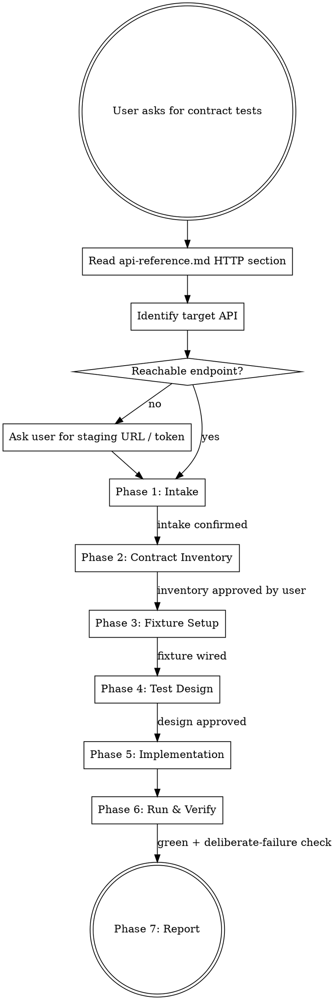

# Contract Testing — API Surface Verification

A structured protocol for writing **contract-style** tests against HTTP backends using the Steps API (`steps.apiGet/Post/Put/Delete/Patch/Head` + `verifyApiStatus`/`verifyApiHeader`). These tests lock the *contract* between a client and a service — status codes, headers, response schema, error shape — without testing business logic or UI.

## Scope & Boundaries — Read Before Starting

**What this skill IS for:**
- Asserting an endpoint returns the expected status for documented inputs
- Asserting response bodies match an expected shape (field names, types, required/optional fields)
- Asserting error responses follow the agreed error contract (status + body shape)
- Asserting critical headers (`content-type`, auth echoes, versioning, CORS)
- Detecting **breaking changes** to the API surface before they reach the UI

**What this skill is NOT for:**
- **End-to-end UI flows** → use `element-interactions` / `test-composer`
- **Deep business logic validation** of internal services → belongs in the service's own test suite
- **True consumer-driven contract testing with brokers** (Pact, Spring Cloud Contract) → this framework doesn't produce/consume pact files. These tests are *contract-style integration tests*, not CDC-with-a-broker. Be honest with the user about this distinction if they ask.
- **Load / performance** testing → wrong tool
- **Security testing** → out of scope

If the user wants a true Pact broker workflow, tell them upfront: *"This framework gives you contract-style assertions over a live endpoint. It doesn't generate or verify pact files against a broker. If you need that, you need Pact. Want to proceed with contract-style tests anyway?"*

---

## Prerequisites

Before starting, verify ALL of these. If any are missing, stop and ask the user.

- Target backend(s) have a reachable URL — staging, sandbox, or local. **Never production without explicit ack.**
- Authentication mechanism is known (none / Bearer / Basic / API key / cookie) AND credentials live in env vars, not source.
- A source of truth for the contract exists — OpenAPI spec, Postman collection, README, or a backend engineer available to confirm shape. Without one, Phase 2 becomes discovery-style and must be confirmed with the user obligation-by-obligation.
- `@civitas-cerebrum/element-interactions` is the project's test framework (check `package.json`).
- `baseFixture` is already wired in `tests/fixtures/base.ts`. If not, Phase 3 covers setup.
- **If `@civitas-cerebrum/element-interactions` is installed via `file:` / `npm link` (local framework development), verify Playwright is not installed twice.** Node's resolver can load `@playwright/test` both from the consuming project and from the linked framework's own `node_modules`, which trips Playwright's singleton guard ("Requiring @playwright/test second time") and produces `No tests found`. Fix: either delete the framework's nested `node_modules/@playwright*` + `node_modules/playwright*`, or add `NODE_OPTIONS=--preserve-symlinks` to your test script.

If the endpoint is unreachable, stop and tell the user: *"Contract tests must hit a real endpoint. I can't mock this. Please point me at a staging / sandbox / local URL."*

---

## 🚨 Absolute Rules

1. **Always read `../element-interactions/references/api-reference.md` → "HTTP API Steps" first.** Do not invent API step signatures. Do not write `steps.apiX` calls from memory. Do NOT reach for Playwright's raw `request.newContext` / `page.request` instead — you lose multi-provider routing, auth header layering, the `tester:api` log channel, and consistency with the rest of the Steps API. If you're tempted because "it's simpler," that's the loophole; close it.
2. **Never hardcode a base URL — and that includes env-var fallbacks.** Base URLs live on `baseFixture` options (`apiBaseUrl` / `apiProviders`), which read env vars at fixture-construction time. Writing `process.env.X ?? 'http://localhost:8080'` inside a test file is a Rule 2 violation in disguise: the fallback ships the hardcoded URL into the repo and survives missing config. Tests address paths (`/users/42`), never origins.
3. **One contract obligation per test.** A test asserts either status, or schema, or a header contract — not a mixed bag. Red flag: a single test that checks status AND envelope fields AND `totalElements === 50` AND item shape is four obligations fused. Split it. Fused tests hide which obligation broke.
4. **Assert shape, not values — and seeded data is still data.** Contract tests check `id: expect.any(Number)`, `title: expect.any(String)`. They do NOT check `title === 'To Kill a Mockingbird'` or `totalElements === 50` just because the seed makes it true today. The moment the seed changes — or the fixture runs against a different environment — the "contract" test fails for a data reason, not a contract reason. Values are data; shape is contract. If you find yourself writing a string literal on the right of `toBe`, stop.
5. **Never mock the endpoint under test.** Contract tests need to hit a real (staging/sandbox) service. If no real endpoint is reachable, stop and tell the user.
6. **Credentials come from env vars.** Never commit tokens, passwords, or API keys into test code.
7. **Type the response.** Always use `steps.apiGet<T>(...)` with an explicit `T` — an untyped contract test is an oxymoron. Note: `await res.json()` on a raw Playwright response returns `Promise<any>`; TypeScript cannot infer the shape. Either use `steps.apiGet<T>` (typed) or declare an interface and cast at the boundary. Inline `(b: { id: string }) => ...` casts on `.map` don't fix the root.
8. **Deliberate-failure check is mandatory before declaring Phase 6 complete.** All green on first run proves nothing — you may have built a vacuous assertion. You MUST mutate one schema field name or status expectation, confirm the test fails with a useful error, then revert. If you skip this, you don't know whether your tests bite. See Phase 6.
9. **Only test documented behavior.** If a query param isn't in the OpenAPI/README/spec, don't assert on it — even if it "seems to work". Undocumented endpoints that coincidentally pass give false confidence, and the moment the backend cleans up the coincidence your contract test breaks on non-contractual behavior. If the user wants it locked, get it documented first.

---

## Workflow



---

### Phase 1 — Intake

Before writing any code, establish these facts. If any are unknown, ask the user:

1. **Target API(s).** One backend or several? Collect a name and base URL for each. Multi-backend is first-class — each becomes an entry in `apiProviders`.
2. **Authentication.** None? Bearer token? Basic? API key header? Cookie? Where do credentials come from (env vars, login call, fixture)?
3. **Environment.** Staging, sandbox, local dev? Never run contract tests against production unless the user explicitly confirms — contract tests are safe (read-only / tested data), but a `POST /users` loop against prod is not.
4. **Source of truth.** OpenAPI spec? README? A Postman collection? Someone's head? Get the user to point at the document that defines the contract — every assertion must trace back to it.
5. **Scope.** All endpoints? A subset? A single endpoint? Default to the endpoints the user names; do not expand scope without asking.

Record the intake in a short checklist and confirm with the user before moving on.

---

### Phase 2 — Contract Inventory

For each endpoint in scope, enumerate the contract obligations the test suite will lock in. A minimal inventory entry looks like:

```
GET /users/:id
  Happy path:
    - 200 on valid id
    - content-type: application/json
    - body: { id: number, name: string, email: string, createdAt: string (ISO) }
  Error contract:
    - 404 on unknown id, body: { error: string, code: string }
    - 401 when token missing, body: { error: string }
    - 400 on malformed id, body: { error: string }
```

Group obligations by endpoint. Do NOT combine endpoints. Do NOT pre-write tests — this is a checklist that gates Phase 5.

If the user has an OpenAPI spec, derive the inventory from it. If not, probe the live endpoint(s) for actual responses and confirm each obligation with the user before testing it — you are **discovering** the contract, not inventing one.

**Implied-but-not-enumerated shape.** Specs often say "returns a paginated list" without enumerating the envelope fields, or document field `foo` without mentioning that the response is actually `{ data: foo }`. Lock only what the spec explicitly names. For the surrounding shape:

- Note the gap in the inventory entry (e.g., *"Spring Page envelope fields (`pageable`, `totalElements`, etc.) are not enumerated in the README — leaving unlocked"*).
- Carry the gap forward to the Phase 7 report so the user can decide whether to ask the backend team to document it.
- Do NOT lock fields the spec doesn't name, even if they appear in every live response. They may be framework defaults the backend team considers internal, and locking them freezes implementation detail as contract.

---

### Phase 3 — Fixture Setup

Add / extend `baseFixture` to wire the API client(s). All API fixture params are optional — only add what's needed.

```ts
// tests/fixtures/base.ts
import { test as base, expect } from '@playwright/test';
import { baseFixture } from '@civitas-cerebrum/element-interactions';

export const test = baseFixture(base, 'tests/data/page-repository.json', {
  apiBaseUrl: process.env.API_BASE_URL,        // default provider
  apiProviders: {                               // optional — only if multi-backend
    billing: process.env.BILLING_BASE_URL!,
    auth:    process.env.AUTH_BASE_URL!,
  },
});
export { expect };
```

- If tests need auth, fold token acquisition into a custom fixture (extend `baseFixture`'s return) or a `beforeAll` that calls `apiPost('auth', '/login', …)` and stores the token in `contextStore` / a closure. Inject it via `headers: { Authorization: 'Bearer …' }` on every request.
- If the target has no public sandbox, tell the user upfront — the test suite will need `API_BASE_URL` pointed at a reachable instance.

---

### Phase 4 — Test Design

For each inventory entry, design tests following these rules:

**One obligation per test:**

```ts
test.describe('GET /users/:id', () => {
  test('returns 200 for a valid id', async ({ steps }) => { /* ... */ });
  test('returns JSON content-type', async ({ steps }) => { /* ... */ });
  test('body matches User schema', async ({ steps }) => { /* ... */ });
  test('returns 404 for unknown id', async ({ steps }) => { /* ... */ });
  test('error body matches ErrorResponse schema', async ({ steps }) => { /* ... */ });
});
```

**Assert shape, not data.** Use `expect.any(...)`, `expect.stringMatching(...)`, `expect.arrayContaining([expect.objectContaining(...)])`. A contract test that asserts `id === 42` breaks the moment the fixture's id changes, which is useless churn. A contract test that asserts `typeof id === 'number'` breaks only when the contract actually breaks.

**Factor schema shapes into a shared file.** Keep them reusable and single-sourced:

```ts
// tests/contracts/schemas.ts
import { expect } from '@playwright/test';

export const UserSchema = {
  id:        expect.any(Number),
  name:      expect.any(String),
  email:     expect.stringMatching(/^[^@]+@[^@]+$/),
  createdAt: expect.stringMatching(/^\d{4}-\d{2}-\d{2}T/),
};

export const ErrorSchema = {
  error: expect.any(String),
  code:  expect.any(String),
};
```

**File layout.** Put contract tests under `tests/contracts/` — one file per endpoint or one file per resource.

```
tests/
  contracts/
    schemas.ts
    users.spec.ts
    invoices.spec.ts
```

**Playwright config for contract tests.** If the existing `playwright.config.ts`'s `testDir` doesn't include `tests/contracts/`, **do NOT widen the shared `testDir`** — that couples UI and API runs (parallelism, retries, reporter, `use.baseURL` all collide). Create a dedicated config instead:

```ts
// playwright.contracts.config.ts
import { defineConfig } from '@playwright/test';

export default defineConfig({
  testDir: './tests/contracts',
  timeout: 15_000,
  retries: 0,                    // contract tests are deterministic — no retries
  reporter: [['list'], ['html', { outputFolder: 'playwright-report-contracts' }]],
  fullyParallel: true,
});
```

Run with `npx playwright test --config=playwright.contracts.config.ts`. Add an npm script (`test:contracts`) for convenience. Never run contract tests inside the UI suite's config — they have different timing, retry, and parallelism characteristics.

---

### Phase 5 — Implementation

Canonical patterns — copy, do not improvise. Every pattern below already appears in `api-reference.md` → "HTTP API Steps"; read that first if anything looks unfamiliar.

**5a. Status check (happy path):**

```ts
test('GET /users/:id returns 200 for a valid id', async ({ steps }) => {
  const res = await steps.apiGet<unknown>('/users/42');
  await steps.verifyApiStatus(res, 200);
});
```

**5b. Header contract:**

```ts
test('GET /users/:id returns JSON content-type', async ({ steps }) => {
  const res = await steps.apiGet<unknown>('/users/42');
  await steps.verifyApiHeader(res, 'content-type', 'application/json; charset=utf-8');
});
```

**5c. Schema shape:**

```ts
import { UserSchema } from './schemas';

test('GET /users/:id body matches User schema', async ({ steps }) => {
  const res = await steps.apiGet<Record<string, unknown>>('/users/42');
  await steps.verifyApiStatus(res, 200);
  expect(res.body).toMatchObject(UserSchema);
});
```

**5d. Error contract:**

```ts
import { ErrorSchema } from './schemas';

test('GET /users/:id returns 404 for unknown id', async ({ steps }) => {
  const res = await steps.apiGet<Record<string, unknown>>('/users/999999999');
  await steps.verifyApiStatus(res, 404);
  expect(res.body).toMatchObject(ErrorSchema);
});
```

**5e. Auth contract:**

```ts
test('GET /users/:id returns 401 when token is missing', async ({ steps }) => {
  const res = await steps.apiGet<unknown>('/users/42', { headers: { Authorization: '' } });
  await steps.verifyApiStatus(res, 401);
});
```

**5f. Write contract (POST shape):**

```ts
test('POST /users accepts valid payload and echoes it', async ({ steps }) => {
  const payload = { name: 'Ada Lovelace', email: 'ada@example.com' };
  const res = await steps.apiPost<Record<string, unknown>>('/users', payload);
  await steps.verifyApiStatus(res, 201);
  expect(res.body).toMatchObject({ id: expect.any(Number), ...payload });
});
```

**5g. Multi-backend cross-check — single test, two providers:**

```ts
test('billing invoice references a real auth user', async ({ steps }) => {
  const invoice = await steps.apiGet<{ userId: number }>('billing', '/invoices/1');
  await steps.verifyApiStatus(invoice, 200);

  const user = await steps.apiGet<unknown>('auth', `/users/${invoice.body.userId}`);
  await steps.verifyApiStatus(user, 200);
});
```

**5h. Unknown shape — discover first, then lock:**

If no OpenAPI exists, run the endpoint once, log `res.body`, design the schema with the user, commit the schema. Don't assert against a shape you haven't confirmed with the user.

**5i. List-shape — array of typed objects:**

```ts
// Envelope shape: content is an array of Book-like objects
test('body carries a content array of Book objects', async ({ steps }) => {
  const res = await steps.apiGet<BooksListResponse>('/books');
  expect(res.body).toMatchObject({
    content: expect.arrayContaining([expect.objectContaining(BookSchema)]),
  });
});

// Per-item shape: every item conforms. Prefer a loop — arrayContaining only
// checks that AT LEAST ONE item matches, which hides rogue elements.
test('each item in content matches the Book schema', async ({ steps }) => {
  const res = await steps.apiGet<BooksListResponse>('/books');
  for (const item of res.body.content) {
    expect(item).toMatchObject(BookSchema);
  }
});
```

Do NOT assert `expect(res.body.content).toHaveLength(50)` — that's a value assertion on seed size, not a contract. If the spec says "at least one", assert `toBeGreaterThan(0)`. If the spec gives bounds, assert bounds (`toBeGreaterThanOrEqual` / `toBeLessThanOrEqual`). Never lock exact counts.

---

### Phase 6 — Run & Verify

1. **Run the suite.** `npx playwright test --config=playwright.contracts.config.ts` (or `tests/contracts/` against the shared config if the project is single-mode). Every test should pass on first run against a known-good environment. If they don't, it means either (a) the contract was misread in Phase 2, or (b) the service is already breaking its contract — both are interesting findings, neither is a "flaky test."
2. **Deliberate-failure check — HARD GATE.** Before advancing to Phase 7, you MUST prove the tests actually bite:
   - Pick one mutation. Either one field in one test (change `id: expect.any(Number)` → `id: expect.any(String)`), OR one shared schema field (change `BookSchema.price: Number` → `String` — expect this to cascade to every test using `BookSchema`, which is correct and healthy), OR one status expectation (`200` → `201`).
   - Run the suite. Confirm that every test that depends on the mutated field fails, with useful error messages (diffs showing the expected-vs-actual type). Tests that don't touch the mutated field should stay green — that's the signal that your obligations are properly split per Rule 3.
   - Revert the mutation. Run again. Confirm all green.
   - Document in the Phase 7 report: *"Deliberate-failure check: mutated [field] → [N] tests failed as expected with [error summary]; unaffected tests stayed green; mutation reverted and full suite re-ran green."*
   - Why this is a hard gate: a green-on-first-run suite with no bite-check is indistinguishable from an empty suite. Skipping this step invalidates Phase 7.
3. **Fail-loudly on shape drift.** If a real test fails with "expected `name` to be a String, got undefined," the contract has drifted. Escalate to the user — do NOT "fix" the test by loosening the assertion. Contract tests break on purpose.
4. **No retries.** Contract tests must not be marked `test.retry()` / `retries: 3`. They are deterministic. If they flake, the endpoint is flaky, which is itself a contract violation.

If a test fails unexpectedly, escalate to the `failure-diagnosis` skill — do NOT silently adjust the schema.

---

### Phase 7 — Report

Produce a short summary for the user:

- Endpoints covered: `GET /users/:id`, `POST /users`, `GET /invoices/:id` (billing provider), …
- Obligations asserted per endpoint: status, content-type, happy-shape, error-shape, auth-shape
- Environment: staging (`https://staging-api.example.com`)
- **Deliberate-failure check:** which test was mutated, what the failure message was, confirmation that it was reverted. (No report ships without this line — see Phase 6 Step 2.)
- Any contract gaps found during Phase 2 that the user needs to decide on (undocumented fields, undocumented error shapes, status mismatches)
- Any undocumented behavior you declined to test, with justification (per Rule 9)

If any shape was discovered rather than derived from a spec, flag it: *"This schema was reverse-engineered from live responses — please confirm with the backend team before treating it as authoritative."*

---

## Integration with Other Skills

| Skill | When it applies |
|---|---|
| `element-interactions` | Parent orchestrator. Routes to this skill per its companion-skills table when contract-testing intent is detected. |
| `failure-diagnosis` | Invoke on an unexpected contract-test failure. Do NOT "fix" by loosening the schema — use `failure-diagnosis` to determine test issue vs. real contract drift (app bug). |
| `test-composer` | Adjacent for UI+API hybrid journeys. If the journey under composition touches an endpoint already locked here, reuse the schema from `tests/contracts/schemas.ts`. |
| `test-repair` | Auto-escalates here if contract tests rot in batch (e.g., backend bumped and multiple schemas drifted simultaneously). |
| `journey-mapping` | Read the journey map to discover which endpoints the UI touches — prioritize those for contract coverage. |
| `bug-discovery` | Unrelated. Bug-discovery targets UI adversarial probing, not API surface. |

## Invocation Options

Orchestrators and users can invoke this skill with optional arguments. Unspecified arguments are resolved in Phase 1 Intake with the user.

- `endpoints` — comma-separated list of endpoints in scope (e.g., `GET /users/:id, POST /users`). Default: whatever the user names during intake.
- `provider` — which configured API provider to target (matches an `apiProviders` key, or `default` for `apiBaseUrl`). Default: `default`.
- `mode` — `full` (status + header + schema + error + auth obligations) or `shape-only` (status + schema only). Default: `full`.
- `environment` — `staging` | `sandbox` | `local` | `production`. Production requires explicit user confirmation for every run. Default: `staging`.

---

## Red Flags — Stop and Ask

| Signal | What to do |
|---|---|
| User wants pact files / broker workflow | Clarify: this framework does contract-style tests, not broker-based CDC. Offer to proceed in contract-style mode or recommend Pact. |
| No reachable endpoint (no staging, no sandbox, no local dev) | Stop. Ask for an environment. Do not mock. |
| User (or *you*) about to assert specific values (`id === 42`, `title === 'To Kill a Mockingbird'`, `totalElements === 50`) | Stop. Contract tests assert shape. Replace with `expect.any(Number)` / `expect.any(String)` / `toBeGreaterThan(0)`. Seeded values are still values. |
| Tempted to use `request.newContext` or `page.request` directly | Stop. Use `steps.apiGet/Post/...`. You'll regret the reimplementation when you need a second provider or auth layering. |
| Writing `process.env.X ?? 'http://localhost:...'` inside a test file | That's a hardcoded base URL. Move it to `baseFixture` options; let the fixture handle env resolution. |
| `const body = await res.json()` with no type | You just got `any`. Either switch to `steps.apiGet<T>`, or declare an interface and cast at the boundary. |
| Planning to widen the shared `testDir` / modify the UI `playwright.config.ts` to pick up contract tests | Stop. Create a separate `playwright.contracts.config.ts` pointed at `tests/contracts/`. Mixing UI and API tests in one config breaks parallelism, retries, and reporter semantics. |
| Bundling status + envelope + schema + count checks into one test | Split. One obligation per test. A fused test hides which obligation broke. |
| Phase 6 green on first run, about to move to Phase 7 | Stop. Run the deliberate-failure check first (mutate one schema field, confirm bite, revert). Green-on-first-run proves nothing. |
| Failing test "fix" would loosen the schema | Stop. The contract is drifting. Escalate to user. |
| Request to test production | Confirm explicitly. Prefer read-only endpoints. Never run write operations against prod without an explicit ack. |
| Credentials in request body / code | Move to env vars. |
| Endpoint returns HTML, not JSON | This isn't a JSON contract test. Either the endpoint is wrong, or you're testing the wrong thing — ask. |
| About to assert on a query param / field not in the spec | Stop. Undocumented behavior isn't contract. Either get it documented first, or don't assert on it. |
| About to assert `toHaveLength(N)` on a list response | Stop. Exact counts are values, not contracts. Use `toBeGreaterThan(0)` or spec-stated bounds. |
| Using `arrayContaining([...])` to assert "all items match" | That only proves *at least one* item matches, which masks rogue elements. Loop over items and `toMatchObject` each. |
| Spec says "paginated" / "returns a list" but doesn't name envelope fields | Lock only what's named. Note the gap in the Phase 7 report. Don't freeze framework-default fields as contract. |

---

## Quick Reference — Steps API for Contract Testing

| Step | Use for |
|---|---|
| `apiGet<T>(path, { query, headers })` | Read endpoints |
| `apiGet<T>(provider, path, { query, headers })` | Read on named provider |
| `apiPost<T>(path, body, { pathParams, query, headers })` | Create endpoints |
| `apiPut<T>(path, body, { pathParams, headers })` | Full update |
| `apiPatch<T>(path, body, { pathParams, headers })` | Partial update |
| `apiDelete<T>(path, { pathParams, headers })` | Delete endpoints |
| `apiHead(path)` → `Record<string, string>` | Header-only probes |
| `verifyApiStatus(res, expectedStatus)` | Status-code contract |
| `verifyApiHeader(res, name, expectedValue?)` | Header presence / value (case-insensitive name) |
| `expect(res.body).toMatchObject(schema)` | Shape / schema contract |

Full signatures in `../element-interactions/references/api-reference.md` → "HTTP API Steps". Read it before writing code.
