# @civitas-cerebrum/element-interactions — Agent Skill

A two-package Playwright framework that decouples **element acquisition** (`@civitas-cerebrum/element-repository`) from **element interaction** (`@civitas-cerebrum/element-interactions`). Tests reference elements by plain strings (`'HomePage'`, `'submitButton'`); raw selectors never appear in test code.

> **Skill names: see `references/skill-registry.md`.** Copy skill names from the registry verbatim. Never reconstruct a skill name from memory or recase it.

## Reference index

This file is the rules-and-pointers kernel. The heavy spec lives in `references/`:

| Reference file | What's in it |
|---|---|
| [`references/api-reference.md`](references/api-reference.md) | The Steps API surface — what to read before writing or modifying any test. |
| [`references/playwright-cli-protocol.md`](references/playwright-cli-protocol.md) | The canonical browser-automation primitive: session model, slug naming, snapshots, auth state, dispatch-brief template. |
| [`references/stages-protocol.md`](references/stages-protocol.md) | Stages 1–4 protocol: scenario discovery, element inspection, write automation, post-stabilization review (4a + 4b). |
| [`references/subagent-return-schema.md`](references/subagent-return-schema.md) | Canonical return + ledger schema for every dispatched subagent. §4.1 grep-based conformance check; §4.2 harness validator (issue #127). |
| [`references/test-optimization.md`](references/test-optimization.md) | Stage 4a optimization checklist + the whole-suite re-run gate. |
| [`references/cascade-detector.md`](references/cascade-detector.md) | Cascade detector — orchestrator that picks the right entry skill from project state. |
| [`references/autonomous-mode-callers.md`](references/autonomous-mode-callers.md) | Per-caller `autonomousMode: true` contracts. |
| [`references/skill-registry.md`](references/skill-registry.md) | Canonical skill name registry. |

## Autonomous-mode invocation cheat-sheet

Companion skills (`onboarding`, `coverage-expansion`, `test-composer`, `companion-mode`) invoke this orchestrator with `autonomousMode: true` to disable the interactive hard gates. Each caller has its own required-args contract — they are NOT interchangeable.

| Caller | Required args | Optional args |
|---|---|---|
| `onboarding` Phase 3 | `autonomousMode: true`, `happyPathDescription: "<sentence>"` | `context: [...]` |
| `coverage-expansion` pass 1–3 | `autonomousMode: true`, `journey: "<j-id>"` | — |
| `companion-mode` Phase-6 graduation | `autonomousMode: true`, `entry: "stage3"`, `bundlePath: "<absolute-path>"` | — |
| user direct | — (no autonomous flags) | — (full Stage 1–4 interactive flow) |

`happyPathDescription` replaces the Stage-1 discovery conversation; `journey: "<j-id>"` references an entry in `tests/e2e/docs/journey-map.md`; `bundlePath` references a `tests/e2e/evidence/<slug>-<ts>/` directory whose `summary.md` carries task description / pass criterion / app URL and whose `spec.ts` carries the already-discovered selectors. `entry: "stage3"` skips Stages 1 and 2 (companion-mode already did the equivalent). Full per-entry-point contracts, bundle-read schema, malformed-bundle handling, and return shape: [`references/autonomous-mode-callers.md`](references/autonomous-mode-callers.md).

## Companion Skills

This skill is the orchestrator for a group of testing skills. It handles Stages 1-4 directly, then activates companion skills for advanced stages:

| Skill | Activates when | What it does |
|---|---|---|
| `journey-mapping` | Before coverage work; map missing or stale | Discovers pages, identifies user journeys, produces the sentinel-bearing `journey-map.md` |
| `coverage-expansion` | User asks to expand coverage, or Stage 5 reached | Iterative journey-by-journey coverage growth (default `mode: depth`, three passes) or a one-pass breadth sweep (`mode: breadth`) |
| `test-composer` | Compose tests for one specific journey (usually called by `coverage-expansion`) | Atomic single-journey scope: happy path + variants, stabilize, API review, coverage verification |
| `bug-discovery` | Automatically after Stage 5 achieves 100% coverage | Adversarial bug hunting after tests pass |
| `test-repair` | User reports a broken/rotted/flaky suite, OR auto-escalated from `failure-diagnosis` / `test-composer` / `bug-discovery` when a run produces many failures at once | Batch repair pipeline: baseline 3× → pattern cluster → adaptive verification → delegate per cluster to `failure-diagnosis` → post-heal verification → summary |
| `agents-vs-agents` | App has AI features, or user mentions AI guardrails/red-teaming/bias testing | Adversarial AI testing with LLM-powered attacker + judge |
| `contract-testing` | User mentions contract tests, API contract, schema test, pact, breaking-change detection, or spec conformance — OR before writing any pure-API test that asserts response shape/status | Structured contract-style verification against real endpoints (status / headers / schema / error shape) using `steps.apiGet/Post/Put/Delete/Patch` |
| `test-catalogue` | User asks for a "test catalogue", "scenario report", "client-ready catalogue", or an inventory of what the suite runs — opt-in only, never mandatory | Parses spec files + journey map, groups scenarios by portal and priority, renders a stakeholder-facing A4-landscape PDF catalogue (plus source HTML) with dedicated regression and skipped-with-reason sections |
| `companion-mode` | User asks for ad-hoc functional verification with evidence (screenshots, video, trace) — opt-in only, never mandatory | Single-task evidence-first verification: produces an immutable bundle at `tests/e2e/evidence/<slug>-<ts>/`, then on a passed run proactively offers durable-automation graduation back into this orchestrator (Stage 3) or into `onboarding` per the project's cascade-detector level. Full behaviour: `skills/companion-mode/SKILL.md`. |

When any of these conditions are met, invoke the Skill tool with the companion skill name. Do not try to handle their workflows inline — they have their own staged processes.

---

## Canonical subagent return + ledger schema

Every subagent dispatched by a companion skill (`coverage-expansion`, `test-composer`, `bug-discovery`) returns findings and writes ledger entries against a single canonical schema documented in [`references/subagent-return-schema.md`](references/subagent-return-schema.md). This is the single source of truth for:

- **Finding-return format** — the `<FINDING-ID> [<severity>] — <title>` block with `scope`, `expected`, `observed`, and `coverage` sub-bullets. Finding-IDs follow `<journey-slug>-<pass>-<nn>` or `<journey-slug>-<nn>`. Severities are `critical | high | medium | low | info` — no others.
- **Return states** — `covered-exhaustively` requires a per-expectation mapping table; `no-new-tests-by-rationalisation` is **not a valid return** from any compositional or adversarial pass.
- **Ledger schema** — the exact Markdown shape of `tests/e2e/docs/adversarial-findings.md`, including `### j-<slug>`, `**Pass <N> — <kind> (YYYY-MM-DD)**`, `Scope:` line, `#### <FINDING-ID>` blocks, and the `**Pass <N> summary:**` footer.

Companion skills MUST cite `references/subagent-return-schema.md` in their SKILL.md and point their subagent dispatch briefs at it rather than re-pasting the schema. Do not fork the schema per skill. Extensions go in the reference file.

Related subagent contracts (read alongside the canonical schema):

- Canonical return + ledger schema: [`references/subagent-return-schema.md`](references/subagent-return-schema.md) — the shared return format, severities, Finding-ID convention, and ledger Markdown shape used by every dispatched subagent.
- Stage A adversarial contract: `skills/coverage-expansion/references/adversarial-subagent-contract.md` — the existing single-stage adversarial subagent's role, inputs, behaviour, and dispatch-brief template. Referenced by `coverage-expansion` adversarial passes.
- Stage B reviewer contract: `skills/coverage-expansion/references/reviewer-subagent-contract.md` — the dual-stage reviewer's role, inputs, behaviour, must-fix calibration, and dispatch-brief template. Referenced by every `coverage-expansion` invocation that dispatches a reviewer.

---

## 🚨 ABSOLUTE RULES — STOP AND READ BEFORE ANY ACTION

**STOP. Do not write any code until you have read and understood every rule below.**
These rules are non-negotiable. They override helpfulness, initiative, and assumptions. If you are unsure about any rule, ask the user. Do not guess.

### 1. Do NOT skip stages
- This skill operates in five stages. You MUST complete each stage and get user approval before advancing.
- Do NOT jump ahead. Do NOT write automation code during the discovery stage.
- Exception: API questions and fix/edit requests bypass the staged flow (see Opening section).
- **Stages 5+**: See Companion Skills table above for when to activate `test-composer`, `bug-discovery`, and `agents-vs-agents`.

### 2. Do NOT edit `page-repository.json` without explicit permission
- Show the user the exact JSON you want to add. Wait for "yes." Then edit.
- No silent additions. No "I'll just add this one locator."

### 3. ALWAYS read `references/api-reference.md` before writing or modifying code
- Before writing test code, modifying selectors, fixing tests, reviewing compliance, or answering API questions — read the API reference first.
- Do not write `steps.*` calls, selector JSON, or fixture code from memory. Ever.
- This applies to every stage, every fix, every edit. No exceptions.

### 4. Do NOT invent selectors — inspect the live site or use user-provided entries

- You do not know what selectors exist on the page. Do not guess.
- Use `@playwright/cli` (see [`references/playwright-cli-protocol.md`](references/playwright-cli-protocol.md)) to navigate to the page and inspect the real DOM. The CLI ships as a hard dependency of this package, so `npx playwright-cli ...` is always reachable after `npm install`.
- If the browser binary is missing (the first `playwright-cli ... open` call fails with a "browser not installed" error), run `npx playwright-cli install-browser chromium` once, then retry.

### 5. Do NOT invent type definitions
- If a type is missing, tell the user. Do not create `.d.ts` stubs or workarounds.

### 6. Prefer element repository entries over inline selectors
- When possible, add selectors to `page-repository.json` and reference them by name.
- Use `{ child: { pageName: 'PageName', elementName: 'elementName' } }` over `{ child: 'td:nth-child(2)' }`.
- This is a preference, not a hard ban — inline selectors are acceptable when a repo entry would be overkill.

### 7. When a test fails: invoke the failure-diagnosis protocol
- The base fixture captures a `failure-screenshot` on every failure.
- Follow the full diagnostic pipeline: collect evidence (screenshot + DOM + error context), group failures by root cause, classify (test issue vs app bug vs ambiguous), check edge cases, then fix or report.
- Do NOT guess what went wrong from the error message alone. The screenshot tells you what actually happened.
- If the screenshot shows a selector problem, re-inspect the live DOM before changing locators.
- A fix is not confirmed until the test passes **3-5 consecutive runs** without failure.

### 8. Before modifying `playwright.config.ts`, read the existing file first
- The package ships documented defaults: `retries`, `use.video: 'on-first-retry'`, `use.trace: 'on-first-retry'`, HTML reporter, headless. See `references/playwright-config-defaults.md` for the canonical config and rationale.
- Don't strip the video / trace / retries defaults without an explicit reason in the PR description — the rerun-documents-failure guarantee `failure-diagnosis` Stage 1 relies on those artefacts.
- The `playwright-config-defaults-guard.sh` hook emits a `systemMessage` warning on writes that drop those defaults, so a deviation is visible to reviewers rather than silent.

### 9. Do NOT work around application bugs — report them
- When a test fails, **classify the problem** before acting:
  - **Test issue (fix it yourself):** wrong selector, test logic error, timing/race condition, missing page-repository entry, incorrect API usage, flaky network — the test is wrong, not the app.
  - **Application bug (report and stop):** the app itself behaves incorrectly — a button doesn't work, a page crashes, data is wrong, a flow is broken, a feature doesn't do what it should, a UI element is missing or misplaced, an API returns an error. The test is correct but the app is broken.
- **How to tell the difference:**
  1. Look at the failure screenshot (Rule 6). Does the app look/behave wrong, or did your test target the wrong thing?
  2. Verify your selectors and API usage are correct. If they are, the problem is in the app.
  3. If a user flow that *should* work based on the scenario doesn't work because the app won't let it — that's an application bug, not a test to fix.
- **When you identify an application bug:**
  1. **STOP.** Do not try to make the test pass.
  2. **Report it to the user** with: what you were testing, what you expected to happen, what actually happened, and the screenshot evidence.
  3. **Leave the test as-is.** The test is correct — it accurately describes what *should* work. Do not modify it to match the broken behavior.
- **There are NO acceptable workarounds for application bugs. This means:**
  - Do NOT change assertions to match the buggy behavior (e.g., expecting an error message instead of success)
  - Do NOT skip, remove, or comment out the failing test flow
  - Do NOT rewrite the test to use an alternative flow that avoids the broken feature
  - Do NOT add try/catch to handle app errors gracefully in the test
  - Do NOT treat an app bug as a test that needs debugging — if the test correctly describes the expected behavior and the app doesn't deliver, the app is wrong
  - Do NOT silently move on to the next scenario as if the failure didn't happen
- **The test's job is to describe correct behavior. If the app doesn't match, that's a bug to report, not a test to fix.**

### 10. Save application context on every page visit or component discovery
This is a **critical action** that must happen automatically during Stages 1, 2, and 5 (Test Composer).

Every time you navigate to a new page or discover a new component (via `playwright-cli` snapshot, DOM inspection, or test execution), you MUST save what you learned to a context file at `tests/e2e/docs/app-context.md`. This file is the team's living knowledge base of the application under test.

**What to save per page/component:**
- **URL pattern** — the route (e.g. `/jobs/{id}/validation`)
- **Page purpose** — one sentence describing what this page does
- **Key sections** — the major UI sections visible on the page
- **Data displayed** — what data fields, labels, and values are shown
- **Interactive elements** — buttons, links, forms, tabs, dropdowns
- **State variations** — how the page looks in different states (empty, loaded, error)
- **Relationships** — what pages link here and where this page links to

**Format for each entry:**
```markdown
## PageName — `/route/pattern`
**Purpose:** One sentence.
**Sections:** List of major UI areas.
**Data fields:** Labels and value types shown.
**Actions:** Buttons, links, forms available.
**States:** Empty state, loaded state, error state variations.
**Navigation:** Reached from → Links to.
**Known issues:** Any bugs or quirks discovered.
```

**When to update:**
- During Stage 1 discovery — as you explore the app
- During Stage 2 inspection — as you inspect DOM elements
- During Stage 5 Test Composer — as you discover new pages in each iteration
- When a test failure screenshot reveals unexpected page state
- When you discover a new route, component, or state variation

**Why this matters:** Without accumulated context, every new session starts from zero. This file lets future sessions understand the app's structure, known states, and edge cases without re-inspecting every page. It also serves as the source of truth for identifying test coverage gaps.

### 11. Browser automation goes through `@playwright/cli`

Every skill in this suite that drives a live browser — `journey-mapping`, `coverage-expansion`, `test-composer`, `bug-discovery`, `failure-diagnosis`, `companion-mode`, this orchestrator's Stages 1–2, `onboarding`'s discovery phases — invokes `@playwright/cli` from the Bash tool. The protocol is documented in [`references/playwright-cli-protocol.md`](references/playwright-cli-protocol.md); read it before composing any browser-using subagent brief.

**Why this rule exists.** Two parallel subagents sharing one browser fight over the active tab and corrupt each other's snapshots — discovery results become non-deterministic, tests compose against stale state, and the parent's own context fills with corrupted transcripts. The CLI's `-s=<name> open` primitive spawns an **isolated browser process per session** with its own user-data directory, so this corruption mode is impossible by construction. There is no isolation-prerequisite check; the OS provides isolation, not the orchestrator.

**What this means for parallel dispatch:**

- Every browser-using subagent is given a unique session slug in its dispatch brief (see `playwright-cli-protocol.md` §3.1 for the naming convention).
- The subagent runs `npx playwright-cli -s=<its-slug> open --browser=chromium <URL>` at the start and `npx playwright-cli -s=<its-slug> close` at the end.
- Siblings have their own slugs; they never share a session.
- The parent runs `npx playwright-cli close-all` at the end of the phase as belt-and-suspenders cleanup.

**No `[mcp-isolation: serializing]` fallback exists** — there is no condition under which the orchestrator should serialize parallel work because of "isolation concerns." The only reason to serialize is when the work itself is sequential (e.g. login required before crawl).

**No install gate.** `@playwright/cli` is a hard `dependencies` entry of this package — after `npm install @civitas-cerebrum/element-interactions` it is always reachable via `npx playwright-cli`. Skills do not run a "tell the user to install the CLI" branch; that prereq is satisfied by the package install itself. The only adjacent prereq is the one-shot browser binary fetch (`npx playwright-cli install-browser chromium`), which the postinstall script reminds the consumer about. Do NOT write `.mcp.json` and do NOT prompt for a Claude Code reload — those were explicit constraints during the migration from MCP and remain in force.

**Forbidden: direct MCP browser tools.** When the harness exposes `mcp__plugin_playwright_playwright__browser_*` tools alongside the CLI, do NOT call them. The MCP browser tools spawn a separate Chrome process with its own user-data-dir (`mcp-chrome-...`), share no state with `playwright-cli` sessions, and write artifacts to a separate `.playwright-mcp/` directory — defeating the per-session OS isolation the CLI guarantees and producing parallel browser stacks that race for shared application state. The CLI is the only sanctioned channel; a tool list that contains both does NOT mean both are permitted. If a subagent's brief somehow surfaces the MCP tools, that brief is malformed — fall back to the CLI from Bash.

### 12. Orchestrator context discipline

Orchestrator skills (`coverage-expansion`, `onboarding`, this orchestrator) hold only **index-level state** in their own context:

- Identifiers, names, priorities, page lists, counters, dispatch rosters.

They do NOT hold:
- Full journey step lists, branches, or state variations beyond what is needed to dispatch.
- Any DOM snapshot or CLI transcript from subagent work.
- Any subagent's produced test source.
- Any stabilization transcript.

Parallel subagents own their own context windows. Context weight lives with the worker, not the conductor. This is how the skill architecture scales to many journeys without blowing the orchestrator's token budget.

### 13. No scope compression in any pass, stage, or phase

If the skill contract says "dispatch per journey" or "run both phases," the orchestrator dispatches per journey and runs both phases. An orchestrator that silently narrows scope is violating the contract regardless of budget, time, or perceived no-op likelihood. Budget-constrained runs return early with a resume-needed message; they do not silently narrow.

### 14. Companion-skill invocations run on the companion's contract, not the caller's estimate

When this orchestrator (or `onboarding`, or any caller) invokes a companion skill — `journey-mapping`, `coverage-expansion`, `test-composer`, `bug-discovery`, `test-repair` — the companion's contract governs the run. The caller does NOT get to pre-emptively decide "I'll only run part of coverage-expansion because the full pipeline is too long," "I'll skip Pass 4–5 because adversarial probing is excessive for this app," or "I'll dispatch a subset of test-composer's variant set because the journey is small."

If the caller estimates the companion's full contract is more work than the session can absorb, the caller has exactly two options:
- **Invoke the companion as designed.** The companion itself owns budget pressure: its own §"Auto-compaction" / resume-needed message handles mid-pipeline budget hits. The caller's job is to dispatch and let the companion run its own contract.
- **Ask the user for an explicit scope reduction before dispatching.** Quote the user's authorisation verbatim when relaying it to the companion (companions like `coverage-expansion` will have their own intent-declaration step that requires the verbatim quote).

Auto-mode does not satisfy "explicit scope reduction." Inferred user preference does not satisfy it. Session-length anxiety does not satisfy it. If the caller cannot fill in a verbatim user quote authorising a reduced scope, the caller dispatches the full contract — period. Calling a companion with a self-authorised "lighter" scope is the same contract violation as silently narrowing one's own scope, just one layer higher.

This rule applies regardless of how reasonable the caller's estimate is. "16 journeys × 5 passes = many hours" is a true statement and not authorisation. Onboarding's front-load gate already disclosed "tens of minutes to several hours" to the user — that disclosure is the user's authorisation for the full pipeline, and the caller is bound by it.

### Workflow
- **Run the tests** to validate your work. Do not skip this.
- **Commit** after every confirmed success. Do not batch.

---

## Staged Workflow

This skill operates in **four stages**. Each stage has a hard gate — you MUST get user approval before advancing to the next stage.

<HARD-GATE>
Do NOT write any automation code until Stage 3. Do NOT create selectors until Stage 2. Do NOT skip the discovery conversation in Stage 1. Every engagement follows all four stages regardless of perceived simplicity.
</HARD-GATE>

### Checklist

You MUST create a task for each of these items and complete them in order (Stages 1-4 are for individual scenarios; Stage 5 is for comprehensive suite expansion):

1. **Understand intent** — read the user's message; only show the greeting menu if intent is unclear
2. **Stage 1: Scenario Discovery** — understand the app, clarify the scenario, produce a formatted scenario
3. **User approves scenario** — hard gate
4. **Stage 2: Element Inspection** — inspect the live app (or receive user-provided selectors), propose page-repository entries
5. **User approves selectors** — hard gate
6. **Stage 3: Write Automation** — write the test using the Steps API and approved selectors
7. **Run and validate** — execute the test, inspect failures visually, iterate until passing
8. **Stage 4a: Test Optimization** — triggers automatically each time a test passes. Load `references/test-optimization.md` and run its 6-check protocol on the new tests; apply auto-fixes; re-stabilize on regression
9. **Stage 4b: API Compliance Review** — triggers automatically once Stage 4a returns clean. Review that test's code against the API Reference; fix any non-compliance
10. **Fix any issues found** — correct misuse from either sub-stage, re-run to confirm still passing
11. **Commit** — commit after each passing + optimized + compliant test case
12. **Repeat 6-11** for each additional scenario the user requests
13. **Onboarding completion gate** — When the user signals they have no more individual scenarios, you MUST explicitly offer Stage 5 before ending the session. See the "Onboarding Completion Gate" section below. Do NOT silently stop.
14. **Stage 5: Test Composer** (on user approval at gate) — invoke the `test-composer` skill for the iterative test composition workflow
15. **Stage 6: Bug Discovery** (auto after Stage 5) — invoke the `bug-discovery` skill to actively probe for bugs

### Process Flow

```dot
digraph element_interactions {
    "Skill activated" [shape=doublecircle];
    "Read user message" [shape=box];
    "Intent clear?" [shape=diamond];
    "Show greeting menu" [shape=box];
    "API question?" [shape=diamond];
    "Answer from API Reference" [shape=box];
    "New scenario?" [shape=diamond];
    "Scale existing?" [shape=diamond];
    "Fix/edit test?" [shape=diamond];

    "STAGE 1: Scenario Discovery" [shape=box, style=bold];
    "Read existing tests\nand page-repository" [shape=box];
    "Get app URL or context" [shape=box];
    "User provided\ncomplete scenario?" [shape=diamond];
    "Reformat into\nGiven/When/Then" [shape=box];
    "Discover app via playwright-cli" [shape=box];
    "Ask clarifying questions\n(one at a time)" [shape=box];
    "Present formatted scenario" [shape=box];
    "User approves scenario?" [shape=diamond];

    "STAGE 2: Element Inspection" [shape=box, style=bold];
    "playwright-cli available?" [shape=diamond];
    "Navigate and inspect DOM" [shape=box];
    "Ask user for selectors" [shape=box];
    "Propose page-repository entries" [shape=box];
    "User approves selectors?" [shape=diamond];

    "STAGE 3: Write Automation" [shape=box, style=bold];
    "Write test using Steps API" [shape=box];
    "Run test" [shape=box];
    "Test passes?" [shape=diamond];
    "New selector needed?" [shape=diamond];
    "Mini-inspection:\ninspect DOM, propose,\nget approval" [shape=box];
    "Inspect screenshot, fix, re-run" [shape=box];

    "STAGE 4a: Test Optimization" [shape=box, style=bold];
    "Run 6-check protocol\n(test-optimization.md)" [shape=box];
    "Issues found in 4a?" [shape=diamond];
    "Fix 4a misuse,\nre-run tests" [shape=box];
    "Test still passes\nafter 4a fixes?" [shape=diamond];
    "STAGE 4b: API Compliance Review" [shape=box, style=bold];
    "Review test code\nagainst API Reference" [shape=box];
    "Issues found in 4b?" [shape=diamond];
    "Fix API misuse,\nre-run tests" [shape=box];
    "Test still passes\nafter 4b fixes?" [shape=diamond];
    "Commit" [shape=doublecircle];

    "Skill activated" -> "Read user message";
    "Read user message" -> "Intent clear?";
    "Intent clear?" -> "Show greeting menu" [label="no — vague request"];
    "Show greeting menu" -> "Intent clear?" [label="user responds"];
    "Intent clear?" -> "API question?" [label="yes"];
    "API question?" -> "Answer from API Reference" [label="yes — no stages needed"];
    "API question?" -> "New scenario?" [label="no"];
    "New scenario?" -> "STAGE 1: Scenario Discovery" [label="yes"];
    "New scenario?" -> "Scale existing?" [label="no"];
    "Scale existing?" -> "Read existing tests\nand page-repository" [label="yes — review existing coverage first"];
    "Read existing tests\nand page-repository" -> "STAGE 1: Scenario Discovery";
    "Scale existing?" -> "Fix/edit test?" [label="no"];
    "Fix/edit test?" -> "STAGE 3: Write Automation" [label="yes — skip to Stage 3"];

    "STAGE 1: Scenario Discovery" -> "Get app URL or context";
    "Get app URL or context" -> "User provided\ncomplete scenario?";
    "User provided\ncomplete scenario?" -> "Reformat into\nGiven/When/Then" [label="yes — fast path"];
    "Reformat into\nGiven/When/Then" -> "Present formatted scenario";
    "User provided\ncomplete scenario?" -> "Discover app via playwright-cli" [label="no"];
    "Discover app via playwright-cli" -> "Ask clarifying questions\n(one at a time)";
    "Ask clarifying questions\n(one at a time)" -> "Present formatted scenario";
    "Present formatted scenario" -> "User approves scenario?";
    "User approves scenario?" -> "Ask clarifying questions\n(one at a time)" [label="no, revise"];
    "User approves scenario?" -> "STAGE 2: Element Inspection" [label="yes"];

    "STAGE 2: Element Inspection" -> "playwright-cli available?";
    "playwright-cli available?" -> "Navigate and inspect DOM" [label="yes"];
    "playwright-cli available?" -> "Ask user for selectors" [label="no"];
    "Navigate and inspect DOM" -> "Propose page-repository entries";
    "Ask user for selectors" -> "Propose page-repository entries";
    "Propose page-repository entries" -> "User approves selectors?";
    "User approves selectors?" -> "Navigate and inspect DOM" [label="no, revise"];
    "User approves selectors?" -> "STAGE 3: Write Automation" [label="yes"];

    "STAGE 3: Write Automation" -> "Write test using Steps API";
    "Write test using Steps API" -> "Run test";
    "Run test" -> "Test passes?";
    "Test passes?" -> "STAGE 4a: Test Optimization" [label="yes"];
    "Test passes?" -> "Classify failure\n(Rule 8)" [label="no"];
    "Classify failure\n(Rule 8)" -> "Report app bug to user\nand STOP" [label="application bug — do not modify test"];
    "Classify failure\n(Rule 8)" -> "New selector needed?" [label="test issue"];
    "New selector needed?" -> "Mini-inspection:\ninspect DOM, propose,\nget approval" [label="yes"];
    "New selector needed?" -> "Inspect screenshot, fix, re-run" [label="no — code issue"];
    "Mini-inspection:\ninspect DOM, propose,\nget approval" -> "Inspect screenshot, fix, re-run";
    "Inspect screenshot, fix, re-run" -> "Run test";

    "STAGE 4a: Test Optimization" -> "Run 6-check protocol\n(test-optimization.md)";
    "Run 6-check protocol\n(test-optimization.md)" -> "Issues found in 4a?" [label="emit structured return"];
    "Issues found in 4a?" -> "STAGE 4b: API Compliance Review" [label="no — clean"];
    "Issues found in 4a?" -> "Fix 4a misuse,\nre-run tests" [label="yes — auto-fix"];
    "Fix 4a misuse,\nre-run tests" -> "Test still passes\nafter 4a fixes?";
    "Test still passes\nafter 4a fixes?" -> "STAGE 4b: API Compliance Review" [label="yes"];
    "Test still passes\nafter 4a fixes?" -> "Inspect screenshot, fix, re-run" [label="no — regression"];

    "STAGE 4b: API Compliance Review" -> "Review test code\nagainst API Reference";
    "Review test code\nagainst API Reference" -> "Issues found in 4b?";
    "Issues found in 4b?" -> "Commit this test" [label="no — compliant"];
    "Issues found in 4b?" -> "Fix API misuse,\nre-run tests" [label="yes"];
    "Fix API misuse,\nre-run tests" -> "Test still passes\nafter 4b fixes?";
    "Test still passes\nafter 4b fixes?" -> "Commit this test" [label="yes"];
    "Test still passes\nafter 4b fixes?" -> "Inspect screenshot, fix, re-run" [label="no — regression"];
    "Commit this test" -> "More scenarios?" [label=""];
    "More scenarios?" -> "STAGE 3: Write Automation" [label="yes — next scenario"];
    "More scenarios?" -> "Offer Stage 5\n(Coverage Expansion)" [label="no"];
    "Offer Stage 5\n(Coverage Expansion)" [shape=box, style=bold];
    "Offer Stage 5\n(Coverage Expansion)" -> "Invoke test-composer skill" [label="user accepts"];
    "Offer Stage 5\n(Coverage Expansion)" -> "Done" [label="user declines"];
    "Invoke test-composer skill" -> "Done";
}
```



---

## Opening

When the skill activates, **read the user's message first**. If they have already described what they want (a scenario, a question, a fix request), route immediately — do NOT repeat the greeting menu.

Only show the greeting menu if the user's message is vague or just says something like "help me with Playwright tests":

> "How can I help you today? I can:
> - **Onboard a fresh project** — detect what's missing and run the full pipeline autonomously (scaffold → happy path → journey mapping → coverage expansion → bug hunts → summary)
> - **Automate a scenario** — describe what you want to test, or give me a link to the app
> - **Scale an existing project** — add more scenarios to an existing test suite
> - **Fix or edit a test** — debug a failing test or modify an existing one
> - **Answer an API question** — help with Steps API syntax, fixtures, or configuration"

### Routing

- **Onboarding intent** — phrases like "onboard this project", "set up element-interactions", "start from scratch", "automate this app from zero", OR a vague message on a project whose cascade detector (see below) reports a non-onboarded state → invoke the `onboarding` companion skill. Do not run Stages 1–4 inline.
- **Coverage expansion intent (deep)** — phrases like "increase coverage", "deeper coverage", "add more scenarios", "iterative test expansion", "expand tests", "deep coverage pass" → invoke `coverage-expansion` with default `mode: depth` (three passes, journey-by-journey, parallel where independent).
- **Coverage expansion intent (breadth)** — phrases like "quick coverage", "fast coverage", "breadth coverage", "sweep coverage" → invoke `coverage-expansion` with `mode: breadth`.
- **Compose tests for one journey** — phrases like "compose tests for journey X", "tests for j-<slug>", "test this journey" → invoke `test-composer` with `args: "journey=<j-id>"`.
- **Companion-mode evidence run** — when the deliverable the user wants is an artifact a human will open (screenshots, video, summary), not a spec they will check in → invoke `companion-mode`. Full trigger list in the registry. Do NOT downshift to Stages 1–4 because it would "be more reusable" — the user asked for evidence, not a durable test.
- **User already described a scenario** — Skip the greeting. Go directly to Stage 1 (fast path if scenario is complete, full discovery if vague).
- **API question** — Answer directly from the API Reference section below. No stages needed.
- **Fix or edit a test** — Skip to Stage 3 (Fix/Edit Mode).
- **Scale existing project** — Read existing test files and `page-repository.json` first to understand current coverage, then proceed to Stage 1 with that context.
- **Vague or no context** — Run the onboarding cascade detector (see the `onboarding` skill). If it returns Level A, B, or C, invoke `onboarding`. If everything is present, show the greeting menu and wait.

#### Onboarding cascade detector (quick reference)

The detector and its full caller-specific response matrix live in [`references/cascade-detector.md`](references/cascade-detector.md). This orchestrator's routing rule is summarised here for fast scanning:

| Level | Routing action |
|---|---|
| A — package not in `package.json` | Invoke `onboarding` |
| B — package present but scaffold incomplete | Invoke `onboarding` |
| C — scaffold complete but `journey-map.md` missing or unsanctioned | Invoke `onboarding` |
| None — all checks pass | No routing action — greet as normal |

---

## Autonomous mode

When the `onboarding` skill (or any other companion) invokes this orchestrator with `args` containing `autonomousMode: true`, the hard gates are disabled and Stages 1–4 run sequentially without prompts.

Full per-entry-point contracts live in [`references/autonomous-mode-callers.md`](references/autonomous-mode-callers.md): required args, the `stage1` vs `stage3` split, the bundle-read schema for `entry: "stage3"`, malformed-bundle handling, gate suspension, commit discipline, and return shape. Read that file when implementing or reviewing a caller. The cheat-sheet at the top of this `SKILL.md` is the at-a-glance summary; the reference doc is the source of truth.

---

## Stages 1–4 protocol

The four-stage pipeline (Stage 1 Scenario Discovery → Stage 2 Element Inspection → Stage 3 Write Automation → Stage 4a Test Optimization + Stage 4b API Compliance Review) is specified in [`references/stages-protocol.md`](references/stages-protocol.md). Read it before authoring or modifying any test under this skill.

### Hard rules — kernel-resident

- **Run stages in order, no skipping.** Skip-to-Stage-3 mode (Stage 3 only, scope = one named test, no new selectors) is the lone exception, narrowly scoped.
- **Hard gates between stages.** Stage 1 → 2: scenario list + page coverage explicit. Stage 2 → 3: every selector lives in `page-repository.json`. Stage 3 → 4a: test passes 3× green in isolation. Stage 4a → 4b: optimization checklist clean. Stage 4b → done: API compliance checklist clean.
- **Stage 4b reviews against `references/api-reference.md` exclusively.** Raw Playwright APIs that have a Steps equivalent are rejected.
- **Every test MUST end with a verification proving the action's effect.** A test that performs actions (click, fill, drag, hover, check, upload, setSliderValue, etc.) and never asserts a resulting state is not a test — it's a smoke call that only catches thrown exceptions. The final meaningful statement must be a `verify*`, a matcher-tree assertion (`.text.toBe`, `.visible.toBeTrue`, `.satisfy`, …), or a typed `expect(extractedValue)` reflecting what the action was supposed to change.
- **Selectors are NEVER invented.** Every selector is either inspected from the live site (Stage 2) or reuses an existing entry in `page-repository.json`. Inline selectors in test code are a hard rule violation.
- **Application bugs are reported, not worked around.** If a bug blocks the test, surface the bug — don't write a test that pretends the bug isn't there.

## API Reference

<CRITICAL>
**You MUST read `references/api-reference.md` before writing ANY test code, selector JSON, or answering API questions. This is not optional.**

Every method signature, argument order, option shape, and selector format MUST come from this file — not from memory, not from training data, not from pattern matching. The API has specific conventions (e.g., `elementName` before `pageName`, `force` dispatches a native event, `isVisible` defaults to 2000ms) that are easy to get wrong from memory. A single wrong argument order silently produces a broken test.

**When to read it:**
- Stage 3 step 3: before writing any test code
- Stage 4 step 1: before reviewing any test code
- Fix/Edit mode: before modifying any test
- API questions: before answering

If you catch yourself writing `steps.*` calls without having read this file in the current session, STOP and read it first.
</CRITICAL>

The API reference is in a separate file to keep this skill lean. Read it when:
- Writing or reviewing test code (Stage 3)
- Performing API compliance review (Stage 4)
- Answering API questions
- Looking up selector formats (css, xpath, role+name, regex text, iframe)

Quick summary of what's available:
- **Setup:** `baseFixture()` with fixtures: `steps`, `repo`, `interactions`, `contextStore`
- **Locators:** `css`, `xpath`, `id`, `text`, `role`+`name` (with regex), regex `text`, iframe-scoped pages
- **Steps API:** navigation, interaction (with `force` click + auto-retry), extraction, verification, `isVisible()` / `isPresent()` probes, listed elements, waiting, composite workflows, screenshots
- **Fluent API:** `steps.on().first().click()`, `ifVisible().click()`, strategy selectors
- **Repository:** `repo.get()`, `getByText()`, `getByAttribute()`, `getByRole()`, `getVisible()`, etc.
- **Email API:** send, receive, mark, clean via SMTP/IMAP
