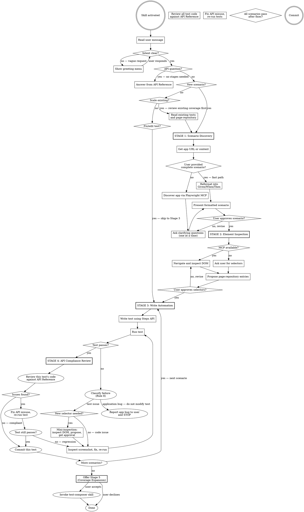

# @civitas-cerebrum/element-interactions — Agent Skill

A two-package Playwright framework that decouples **element acquisition** (`@civitas-cerebrum/element-repository`) from **element interaction** (`@civitas-cerebrum/element-interactions`). Tests reference elements by plain strings (`'HomePage'`, `'submitButton'`); raw selectors never appear in test code.

## Companion Skills

This skill is the orchestrator for a group of testing skills. It handles Stages 1-4 directly, then activates companion skills for advanced stages:

| Skill | Activates when | What it does |
|---|---|---|
| `test-composer` | User asks to expand coverage, or Stage 5 reached | Iterative test suite expansion across the full app |
| `bug-discovery` | Automatically after Stage 5 achieves 100% coverage | Adversarial bug hunting after tests pass |
| `agents-vs-agents` | App has AI features, or user mentions AI guardrails/red-teaming/bias testing | Adversarial AI testing with LLM-powered attacker + judge |

When any of these conditions are met, invoke the Skill tool with the companion skill name. Do not try to handle their workflows inline — they have their own staged processes.

---

## 🚨 ABSOLUTE RULES — STOP AND READ BEFORE ANY ACTION

**STOP. Do not write any code until you have read and understood every rule below.**
These rules are non-negotiable. They override helpfulness, initiative, and assumptions. If you are unsure about any rule, ask the user. Do not guess.

### 1. Do NOT skip stages
- This skill operates in five stages. You MUST complete each stage and get user approval before advancing.
- Do NOT jump ahead. Do NOT write automation code during the discovery stage.
- Exception: API questions and fix/edit requests bypass the staged flow (see Opening section).
- **Stages 5+**: See Companion Skills table above for when to activate `test-composer`, `bug-discovery`, and `agents-vs-agents`.

### 2. Do NOT edit `page-repository.json` without explicit permission
- Show the user the exact JSON you want to add. Wait for "yes." Then edit.
- No silent additions. No "I'll just add this one locator."

### 3. ALWAYS read `references/api-reference.md` before writing or modifying code
- Before writing test code, modifying selectors, fixing tests, reviewing compliance, or answering API questions — read the API reference first.
- Do not write `steps.*` calls, selector JSON, or fixture code from memory. Ever.
- This applies to every stage, every fix, every edit. No exceptions.

### 4. Do NOT invent selectors — inspect the live site or use user-provided entries

- You do not know what selectors exist on the page. Do not guess.
- Use the Playwright MCP to navigate to the page and inspect the real DOM.
- If the Playwright MCP is not available, tell the user:
  > "I don't have the Playwright MCP to inspect the site. You can either enable it in your Claude Code MCP settings, or provide me with the `page-repository.json` entries directly and I'll use those."
- Without the MCP, the user must supply all selectors. Do NOT guess or infer selectors from the scenario description alone.

### 5. Do NOT invent type definitions
- If a type is missing, tell the user. Do not create `.d.ts` stubs or workarounds.

### 6. Prefer element repository entries over inline selectors
- When possible, add selectors to `page-repository.json` and reference them by name.
- Use `{ child: { pageName: 'PageName', elementName: 'elementName' } }` over `{ child: 'td:nth-child(2)' }`.
- This is a preference, not a hard ban — inline selectors are acceptable when a repo entry would be overkill.

### 7. When a test fails: invoke the failure-diagnosis protocol
- The base fixture captures a `failure-screenshot` on every failure.
- Follow the full diagnostic pipeline: collect evidence (screenshot + DOM + error context), group failures by root cause, classify (test issue vs app bug vs ambiguous), check edge cases, then fix or report.
- Do NOT guess what went wrong from the error message alone. The screenshot tells you what actually happened.
- If the screenshot shows a selector problem, re-inspect the live DOM before changing locators.
- A fix is not confirmed until the test passes **3-5 consecutive runs** without failure.

### 8. Before modifying `playwright.config.ts`, read the existing file first

### 9. Do NOT work around application bugs — report them
- When a test fails, **classify the problem** before acting:
  - **Test issue (fix it yourself):** wrong selector, test logic error, timing/race condition, missing page-repository entry, incorrect API usage, flaky network — the test is wrong, not the app.
  - **Application bug (report and stop):** the app itself behaves incorrectly — a button doesn't work, a page crashes, data is wrong, a flow is broken, a feature doesn't do what it should, a UI element is missing or misplaced, an API returns an error. The test is correct but the app is broken.
- **How to tell the difference:**
  1. Look at the failure screenshot (Rule 6). Does the app look/behave wrong, or did your test target the wrong thing?
  2. Verify your selectors and API usage are correct. If they are, the problem is in the app.
  3. If a user flow that *should* work based on the scenario doesn't work because the app won't let it — that's an application bug, not a test to fix.
- **When you identify an application bug:**
  1. **STOP.** Do not try to make the test pass.
  2. **Report it to the user** with: what you were testing, what you expected to happen, what actually happened, and the screenshot evidence.
  3. **Leave the test as-is.** The test is correct — it accurately describes what *should* work. Do not modify it to match the broken behavior.
- **There are NO acceptable workarounds for application bugs. This means:**
  - Do NOT change assertions to match the buggy behavior (e.g., expecting an error message instead of success)
  - Do NOT skip, remove, or comment out the failing test flow
  - Do NOT rewrite the test to use an alternative flow that avoids the broken feature
  - Do NOT add try/catch to handle app errors gracefully in the test
  - Do NOT treat an app bug as a test that needs debugging — if the test correctly describes the expected behavior and the app doesn't deliver, the app is wrong
  - Do NOT silently move on to the next scenario as if the failure didn't happen
- **The test's job is to describe correct behavior. If the app doesn't match, that's a bug to report, not a test to fix.**

### 10. Save application context on every page visit or component discovery
This is a **critical action** that must happen automatically during Stages 1, 2, and 5 (Test Composer).

Every time you navigate to a new page or discover a new component (via Playwright MCP snapshot, DOM inspection, or test execution), you MUST save what you learned to a context file at `tests/e2e/docs/app-context.md`. This file is the team's living knowledge base of the application under test.

**What to save per page/component:**
- **URL pattern** — the route (e.g. `/jobs/{id}/validation`)
- **Page purpose** — one sentence describing what this page does
- **Key sections** — the major UI sections visible on the page
- **Data displayed** — what data fields, labels, and values are shown
- **Interactive elements** — buttons, links, forms, tabs, dropdowns
- **State variations** — how the page looks in different states (empty, loaded, error)
- **Relationships** — what pages link here and where this page links to

**Format for each entry:**
```markdown
## PageName — `/route/pattern`
**Purpose:** One sentence.
**Sections:** List of major UI areas.
**Data fields:** Labels and value types shown.
**Actions:** Buttons, links, forms available.
**States:** Empty state, loaded state, error state variations.
**Navigation:** Reached from → Links to.
**Known issues:** Any bugs or quirks discovered.
```

**When to update:**
- During Stage 1 discovery — as you explore the app
- During Stage 2 inspection — as you inspect DOM elements
- During Stage 5 Test Composer — as you discover new pages in each iteration
- When a test failure screenshot reveals unexpected page state
- When you discover a new route, component, or state variation

**Why this matters:** Without accumulated context, every new session starts from zero. This file lets future sessions understand the app's structure, known states, and edge cases without re-inspecting every page. It also serves as the source of truth for identifying test coverage gaps.

### Workflow
- **Run the tests** to validate your work. Do not skip this.
- **Commit** after every confirmed success. Do not batch.

---

## Staged Workflow

This skill operates in **four stages**. Each stage has a hard gate — you MUST get user approval before advancing to the next stage.

<HARD-GATE>
Do NOT write any automation code until Stage 3. Do NOT create selectors until Stage 2. Do NOT skip the discovery conversation in Stage 1. Every engagement follows all four stages regardless of perceived simplicity.
</HARD-GATE>

### Checklist

You MUST create a task for each of these items and complete them in order (Stages 1-4 are for individual scenarios; Stage 5 is for comprehensive suite expansion):

1. **Understand intent** — read the user's message; only show the greeting menu if intent is unclear
2. **Stage 1: Scenario Discovery** — understand the app, clarify the scenario, produce a formatted scenario
3. **User approves scenario** — hard gate
4. **Stage 2: Element Inspection** — inspect the live app (or receive user-provided selectors), propose page-repository entries
5. **User approves selectors** — hard gate
6. **Stage 3: Write Automation** — write the test using the Steps API and approved selectors
7. **Run and validate** — execute the test, inspect failures visually, iterate until passing
8. **Stage 4: API Compliance Review** — triggers automatically each time a test passes. Review that test's code against the API Reference before proceeding
9. **Fix any issues found** — correct API misuse, re-run to confirm still passing
10. **Commit** — commit after each passing + compliant test case
11. **Repeat 6-10** for each additional scenario the user requests
12. **Onboarding completion gate** — When the user signals they have no more individual scenarios, you MUST explicitly offer Stage 5 before ending the session. See the "Onboarding Completion Gate" section below. Do NOT silently stop.
13. **Stage 5: Test Composer** (on user approval at gate) — invoke the `test-composer` skill for the iterative test composition workflow
14. **Stage 6: Bug Discovery** (auto after Stage 5) — invoke the `bug-discovery` skill to actively probe for bugs

### Process Flow



---

## Opening

When the skill activates, **read the user's message first**. If they have already described what they want (a scenario, a question, a fix request), route immediately — do NOT repeat the greeting menu.

Only show the greeting menu if the user's message is vague or just says something like "help me with Playwright tests":

> "How can I help you today? I can:
> - **Automate a scenario** — describe what you want to test, or give me a link to the app
> - **Scale an existing project** — add more scenarios to an existing test suite
> - **Fix or edit a test** — debug a failing test or modify an existing one
> - **Answer an API question** — help with Steps API syntax, fixtures, or configuration"

### Routing

- **User already described a scenario** — Skip the greeting. Go directly to Stage 1 (fast path if scenario is complete, full discovery if vague).
- **API question** — Answer directly from the API Reference section below. No stages needed.
- **Fix or edit a test** — Skip to Stage 3 (Fix/Edit Mode).
- **Scale existing project** — Read existing test files and `page-repository.json` first to understand current coverage, then proceed to Stage 1 with that context.
- **Vague or no context** — Show the greeting menu and wait for the user's response.

---

## Stage 1: Scenario Discovery

**Goal:** Understand the application and produce a clear, conventional scenario that the user approves.

### Fast Path

If the user provides a complete scenario or detailed acceptance criteria upfront, do NOT ask unnecessary discovery questions. Instead:

1. Reformat their scenario into the Given/When/Then structure below, favouring clear, discrete steps.
2. Ask only about anything that is genuinely unclear or ambiguous.
3. Present the formatted scenario for approval.

### Full Discovery Process

When the user provides a URL, a vague idea, or needs help figuring out what to test:

1. **Get the app URL or acceptance criteria.** The user may provide a URL, a description of the scenario, or both. If they provide a URL, use the Playwright MCP to navigate and explore.
2. **Discover the app.** Use the Playwright MCP to navigate to the app, take snapshots, and understand what the application does. Explore the pages relevant to the scenario.
3. **Ask clarifying questions — one at a time.** Focus on understanding:
   - What is the user flow being tested?
   - What are the preconditions (logged in? specific data state?)
   - What constitutes success vs failure?
   - Are there edge cases to cover?
4. **Present the scenario** in conventional Given/When/Then format:

```
Scenario: [Descriptive name]
  Given [precondition]
  And [additional precondition if needed]
  When [action the user takes]
  And [additional action if needed]
  Then [expected outcome]
  And [additional verification if needed]
```

For complex flows, break into multiple scenarios.

### Hard Gate

> "Here's the scenario I've drafted. Does this accurately capture what you want to automate? Any changes before I move on to inspecting the page elements?"

**Wait for explicit approval.** If the user wants changes, revise and re-present. Do NOT proceed to Stage 2 until the scenario is approved.

---

## Stage 2: Element Inspection

**Goal:** Identify all elements needed for the approved scenario and propose page-repository entries.

### With Playwright MCP

1. **Navigate to each page** involved in the scenario using the Playwright MCP.
2. **Take snapshots** and inspect the DOM to find reliable selectors for each element referenced in the scenario.
3. **Prefer selectors in this order:** `data-test` / `data-testid` attributes > `id` > stable CSS selectors > text > XPath.
4. **Build the page-repository entries.** For each element, determine the best selector strategy.
5. **Check existing `page-repository.json`** — if some elements already exist, note which ones are new vs already covered.

### Without Playwright MCP

If the MCP is not available, ask the user to provide the selectors:

> "I don't have the Playwright MCP to inspect the page. Could you provide the selectors for the elements in the scenario? I need entries for: [list elements from the approved scenario]. You can give me CSS selectors, IDs, text values, or full page-repository JSON entries."

Use whatever the user provides to build the page-repository entries. Do NOT guess or infer selectors.

### Present Proposed Selectors

Show the user the exact JSON entries you want to add:

```json
{
  "pages": [
    {
      "name": "LoginPage",
      "elements": [
        { "elementName": "usernameInput", "selector": { "css": "input[data-test='username']" } },
        { "elementName": "passwordInput", "selector": { "css": "input[data-test='password']" } },
        { "elementName": "submitButton", "selector": { "css": "button[type='submit']", "text": "Log In" } }
      ]
    }
  ]
}
```

### Hard Gate

> "These are the selectors I've identified for the scenario. Should I add them to `page-repository.json`? Let me know if any need adjusting."

**Wait for explicit approval.** Do NOT edit `page-repository.json` until the user says yes. If changes are requested, re-inspect and re-present.

---

## Stage 3: Write Automation

**Goal:** Write the Playwright test using the Steps API and approved page-repository entries.

### Writing Process

1. **Check project setup.** Read `tests/fixtures/base.ts` and `playwright.config.ts` — create or update only if missing or broken. Also verify that `.gitignore` includes `.claude/` and `CLAUDE.md` to prevent Claude Code configuration from being pushed to the repository — add them if missing.
2. **Add approved selectors** to `page-repository.json` (if not already done).
3. **Read `references/api-reference.md`** — load the full API reference before writing any test code. Do not write from memory.
4. **Write the test file** using the Steps API. Every interaction goes through `steps.*` methods — no raw `page.locator()` calls.
5. **Every test MUST end with a verification of the action's effect.** A test that performs actions (click, fill, drag, hover, check, upload, setSliderValue, etc.) and never asserts a resulting state is not a test — it's a smoke call that only catches thrown exceptions. Before declaring a test done, confirm the final meaningful statement is a `verify*`, a matcher-tree assertion (`.text.toBe`, `.visible.toBeTrue`, `.satisfy`, …), or a typed `expect(extractedValue)` that reflects what the action was supposed to change. If the exercised action has no observable side-effect in the app under test (rare — usually a framework-level smoke case), state that in a one-line comment and fall back to the weakest defensible check (`verifyState('visible')` on the target element). Never leave a test trailing on an action.
6. **Run the test** with `npx playwright test <test-file>`.
7. **If the test fails:** invoke the `failure-diagnosis` protocol — collect evidence (screenshot, DOM, error context), group failures by root cause, classify (test issue vs app bug vs ambiguous), check edge cases, then fix test issues autonomously with stability validation (3-5 passing runs) or report app bugs with full evidence. If the fix requires new selectors, use Playwright MCP to inspect the DOM, propose the new entry, and get approval before editing.
8. **If the test passes:** commit immediately.

### Skip-to-Stage-3 (Fix/Edit Mode)

When the user asks to fix or edit an existing test, skip Stages 1 and 2. Read `references/api-reference.md`, then read the existing test, understand the issue, and proceed directly to fixing and running. If fixing requires new selectors, use the mini-inspection flow described above — do NOT silently add selectors.

---

## Stage 4: API Compliance Review

**Goal:** Review test code against the API Reference to ensure correct usage of the `@civitas-cerebrum/element-interactions` package.

**This stage triggers automatically every time a test reaches passing state** in Stage 3. Do NOT batch — review each test case immediately after it passes, before moving on to the next scenario. Even if the tests pass, they may be using the API incorrectly (wrong argument order, deprecated methods, missing options, incorrect types). Catching issues early prevents the same mistake from propagating into subsequent test cases.

### Review Checklist

For each test file, verify:

1. **Method signatures** — every `steps.*` call matches the exact signature in the API Reference (correct argument count, correct argument order, correct types).
2. **Imports** — all types used (`DropdownSelectType`, `EmailFilterType`, `FillFormValue`, etc.) are imported from `@civitas-cerebrum/element-interactions` (or `@civitas-cerebrum/email-client` for email types). No invented imports.
3. **Page/element naming** — `pageName` uses PascalCase, `elementName` uses camelCase, and both match entries in `page-repository.json`.
4. **Listed element options** — `child` uses `{ pageName, elementName }` repo references where possible instead of inline selectors (per Rule 5).
5. **Dropdown select usage** — `DropdownSelectType.RANDOM`, `.VALUE`, or `.INDEX` with the correct companion field (`value` or `index`).
6. **Email API usage** — `steps.sendEmail` / `steps.receiveEmail` / `steps.receiveAllEmails` / `steps.cleanEmails` match the documented signatures. Filter types use `EmailFilterType` enum.
7. **No raw Playwright calls** — no `page.locator()`, `page.click()`, `page.fill()`, or other raw Playwright methods where a `steps.*` equivalent exists.
8. **Fixture usage** — the test destructures only fixtures provided by `baseFixture` (`steps`, `repo`, `interactions`, `contextStore`, `page`) plus any custom fixtures defined in the project's `base.ts`.
9. **Waiting methods** — correct state strings (`'visible'`, `'hidden'`, `'attached'`, `'detached'`) and correct usage of `waitForResponse` callback pattern.
10. **Verification methods** — correct option shapes (`{ exactly }`, `{ greaterThan }`, `{ lessThan }` for `verifyCount`; `verifyText()` with no args asserts not empty). The 4-arg form `verifyText(el, page, undefined, { notEmpty: true })` and the `TextVerifyOptions.notEmpty` flag are deprecated — use `verifyText(el, page)` (or `.on(el, page).verifyText()` fluent) instead.
11. **Every test ends with a verification.** No test may finish on an action (`click`, `fill`, `drag`, `hover`, `check`, `upload`, `setSliderValue`, etc.) with no trailing assertion of the resulting state. If a test's final statement is an action, flag it and add the appropriate `verify*` / matcher-tree / `expect(extractedValue)` assertion. Pure smoke-shape exercises are allowed only when explicitly justified in a comment AND they still include the weakest defensible check (e.g. `verifyState('visible')` on the target). "The action didn't throw" is not a verification.

### Process

1. **Read `references/api-reference.md`** — load the full API reference. Do not review from memory.
2. **Read each test file** written or modified in this session.
3. **Cross-reference every API call** against the API Reference.
4. **Report findings** to the user — list any issues found with the specific line, what's wrong, and the correct usage.
5. **If issues are found:** investigate *why* the non-compliant code was written — was the API misunderstood? Was a method signature wrong in the scenario? Did a previous stage produce incorrect assumptions? Understanding the root cause prevents the same mistake from recurring in the next scenario. Then fix, re-run the tests, and confirm they still pass.
6. **If fixes cause a test failure:** follow Rule 6 — inspect the failure screenshot first before attempting any further fix. Do NOT guess from the error message alone.
7. **If no issues are found:** confirm compliance and proceed to commit.

### Output Format

Present the review as:

> **API Compliance Review**
>
> Reviewed: `tests/example.spec.ts`, `tests/login.spec.ts`
>
> - **`example.spec.ts:15`** — `steps.backOrForward('back')` should be `steps.backOrForward('BACKWARDS')` (uses uppercase enum-style strings)
> - **`login.spec.ts:8`** — missing import for `DropdownSelectType`
>
> [number] issue(s) found. Fixing now.

Or if clean:

> **API Compliance Review**
>
> Reviewed: `tests/example.spec.ts`
>
> All API calls match the documented signatures. No issues found.

---

## Onboarding Completion Gate

**Goal:** When the user signals they have no more individual scenarios to add (the "onboarding cycle" — Stages 1-4 — is complete), explicitly offer Stage 5 (Coverage Expansion) instead of silently ending the session.

### When this gate triggers

After any Stage 4 commit, when the user indicates they are done adding individual scenarios — for example by saying "that's all", "we're done", "no more for now", or by simply not requesting another scenario after a reasonable pause.

### What to do

1. **Summarize what was built in the onboarding cycle.** Briefly list the scenarios committed, the pages covered, and the page-repository entries added. Keep it to 3-5 lines.
2. **Run a readiness check** before offering Stage 5:
   - All committed tests pass on a clean re-run
   - `page-repository.json` is valid JSON and matches the tests
   - `tests/e2e/docs/app-context.md` exists and reflects the pages discovered so far
   - No open API compliance issues from Stage 4
   - If any check fails, fix it first — do NOT offer Stage 5 with a broken baseline
3. **Present the offer to the user verbatim:**

> **Onboarding cycle complete.**
>
> You now have an initial test suite that covers the scenarios you described. The next stage is **Coverage Expansion** — I would systematically probe the rest of the application, identify uncovered pages and flows, and build out the suite until every page and interactive element has test coverage. This typically takes multiple iteration cycles and runs more autonomously than the staged onboarding flow.
>
> Would you like me to proceed to **Stage 5: Coverage Expansion**? I can also:
> - **Pause here** — I'll stop and you can resume any time by asking
> - **Jump straight to Bug Discovery (Stage 6)** — only recommended if you already have comprehensive coverage from a previous session
> - **Generate a work summary deck** — produce a stakeholder-facing report of what was built so far

4. **Wait for explicit user choice.** Do NOT auto-proceed. Do NOT assume yes.
5. **On user approval of Stage 5:** invoke the `test-composer` skill via the Skill tool. Pass along the readiness check results and the list of pages already covered so test-composer's Step 1 (Inventory) starts from a known baseline.
6. **On user pause:** confirm the session is at a clean stopping point and end gracefully. Remind the user how to resume ("just say 'expand coverage' or 'add more tests' next time").

### Hard rule

Do NOT silently end the session after Stage 4. The onboarding cycle was an entry point — the user may not realize Stage 5 exists. Always surface it.

---

## API Reference

<CRITICAL>
**You MUST read `references/api-reference.md` before writing ANY test code, selector JSON, or answering API questions. This is not optional.**

Every method signature, argument order, option shape, and selector format MUST come from this file — not from memory, not from training data, not from pattern matching. The API has specific conventions (e.g., `elementName` before `pageName`, `force` dispatches a native event, `isVisible` defaults to 2000ms) that are easy to get wrong from memory. A single wrong argument order silently produces a broken test.

**When to read it:**
- Stage 3 step 3: before writing any test code
- Stage 4 step 1: before reviewing any test code
- Fix/Edit mode: before modifying any test
- API questions: before answering

If you catch yourself writing `steps.*` calls without having read this file in the current session, STOP and read it first.
</CRITICAL>

The API reference is in a separate file to keep this skill lean. Read it when:
- Writing or reviewing test code (Stage 3)
- Performing API compliance review (Stage 4)
- Answering API questions
- Looking up selector formats (css, xpath, role+name, regex text, iframe)

Quick summary of what's available:
- **Setup:** `baseFixture()` with fixtures: `steps`, `repo`, `interactions`, `contextStore`
- **Locators:** `css`, `xpath`, `id`, `text`, `role`+`name` (with regex), regex `text`, iframe-scoped pages
- **Steps API:** navigation, interaction (with `force` click + auto-retry), extraction, verification, `isVisible()` / `isPresent()` probes, listed elements, waiting, composite workflows, screenshots
- **Fluent API:** `steps.on().first().click()`, `ifVisible().click()`, strategy selectors
- **Repository:** `repo.get()`, `getByText()`, `getByAttribute()`, `getByRole()`, `getVisible()`, etc.
- **Email API:** send, receive, mark, clean via SMTP/IMAP
