# @civitas-cerebrum/element-interactions — Agent Skill

A two-package Playwright framework that decouples **element acquisition** (`@civitas-cerebrum/element-repository`) from **element interaction** (`@civitas-cerebrum/element-interactions`). Tests reference elements by plain strings (`'HomePage'`, `'submitButton'`); raw selectors never appear in test code.

## Companion Skills

This skill is the orchestrator for a group of testing skills. It handles Stages 1-4 directly, then activates companion skills for advanced stages:

| Skill | Activates when | What it does |
|---|---|---|
| `test-composer` | User asks to expand coverage, or Stage 5 reached | Iterative test suite expansion across the full app |
| `bug-discovery` | Automatically after Stage 5 achieves target coverage | Adversarial bug hunting after tests pass |
| `agents-vs-agents` | App has AI features, or user mentions AI guardrails/red-teaming/bias testing | Adversarial AI testing with LLM-powered attacker + judge |

When any of these conditions are met, invoke the Skill tool with the companion skill name. Do not try to handle their workflows inline — they have their own staged processes.

---

## 🚨 ABSOLUTE RULES — STOP AND READ BEFORE ANY ACTION

**STOP. Do not write any code until you have read and understood every rule below.**
These rules are non-negotiable. They override helpfulness, initiative, and assumptions. If you are unsure about any rule, ask the user. Do not guess.

### 1. Do NOT skip stages
- This skill operates in five stages. You MUST complete each stage and get user approval before advancing.
- Do NOT jump ahead. Do NOT write automation code during the discovery stage.
- Exception: API questions and fix/edit requests bypass the staged flow (see Opening section).
- **Stages 5+**: See Companion Skills table above for when to activate `test-composer`, `bug-discovery`, and `agents-vs-agents`.

### 2. Do NOT edit `page-repository.json` without explicit permission
- Show the user the exact JSON you want to add. Wait for "yes." Then edit.
- No silent additions. No "I'll just add this one locator."

### 3. Do NOT invent selectors — inspect the live site or use user-provided entries
- You do not know what selectors exist on the page. Do not guess.
- Use the Playwright MCP to navigate to the page and inspect the real DOM.
- If the Playwright MCP is not available, tell the user:
  > "I don't have the Playwright MCP to inspect the site. You can either enable it in your Claude Code MCP settings, or provide me with the `page-repository.json` entries directly and I'll use those."
- Without the MCP, the user must supply all selectors. Do NOT guess or infer selectors from the scenario description alone.

### 4. Do NOT invent type definitions
- If a type is missing, tell the user. Do not create `.d.ts` stubs or workarounds.

### 5. Prefer element repository entries over inline selectors
- When possible, add selectors to `page-repository.json` and reference them by name.
- Use `{ child: { pageName: 'PageName', elementName: 'elementName' } }` over `{ child: 'td:nth-child(2)' }`.
- This is a preference, not a hard ban — inline selectors are acceptable when a repo entry would be overkill.

### 6. When a test fails: look at the screenshot FIRST
- The base fixture captures a `failure-screenshot` on every failure.
- Run `npx playwright show-report` and look at the screenshot before doing anything else.
- Do NOT guess what went wrong from the error message alone. The screenshot tells you what actually happened.
- If the screenshot shows a selector problem, re-inspect the live DOM before changing locators.

### 7. Before modifying `playwright.config.ts`, read the existing file first

### 8. Save application context on every page visit or component discovery
This is a **critical action** that must happen automatically during Stages 1, 2, and 5 (Test Composer).

Every time you navigate to a new page or discover a new component (via Playwright MCP snapshot, DOM inspection, or test execution), you MUST save what you learned to a context file at `tests/e2e/docs/app-context.md`. This file is the team's living knowledge base of the application under test.

**What to save per page/component:**
- **URL pattern** — the route (e.g. `/jobs/{id}/validation`)
- **Page purpose** — one sentence describing what this page does
- **Key sections** — the major UI sections visible on the page
- **Data displayed** — what data fields, labels, and values are shown
- **Interactive elements** — buttons, links, forms, tabs, dropdowns
- **State variations** — how the page looks in different states (empty, loaded, error)
- **Relationships** — what pages link here and where this page links to

**Format for each entry:**
```markdown
## PageName — `/route/pattern`
**Purpose:** One sentence.
**Sections:** List of major UI areas.
**Data fields:** Labels and value types shown.
**Actions:** Buttons, links, forms available.
**States:** Empty state, loaded state, error state variations.
**Navigation:** Reached from → Links to.
**Known issues:** Any bugs or quirks discovered.
```

**When to update:**
- During Stage 1 discovery — as you explore the app
- During Stage 2 inspection — as you inspect DOM elements
- During Stage 5 Test Composer — as you discover new pages in each iteration
- When a test failure screenshot reveals unexpected page state
- When you discover a new route, component, or state variation

**Why this matters:** Without accumulated context, every new session starts from zero. This file lets future sessions understand the app's structure, known states, and edge cases without re-inspecting every page. It also serves as the source of truth for identifying test coverage gaps.

### Workflow
- **Run the tests** to validate your work. Do not skip this.
- **Commit** after every confirmed success. Do not batch.

---

## Staged Workflow

This skill operates in **four stages**. Each stage has a hard gate — you MUST get user approval before advancing to the next stage.

<HARD-GATE>
Do NOT write any automation code until Stage 3. Do NOT create selectors until Stage 2. Do NOT skip the discovery conversation in Stage 1. Every engagement follows all four stages regardless of perceived simplicity.
</HARD-GATE>

### Checklist

You MUST create a task for each of these items and complete them in order (Stages 1-4 are for individual scenarios; Stage 5 is for comprehensive suite expansion):

1. **Understand intent** — read the user's message; only show the greeting menu if intent is unclear
2. **Stage 1: Scenario Discovery** — understand the app, clarify the scenario, produce a formatted scenario
3. **User approves scenario** — hard gate
4. **Stage 2: Element Inspection** — inspect the live app (or receive user-provided selectors), propose page-repository entries
5. **User approves selectors** — hard gate
6. **Stage 3: Write Automation** — write the test using the Steps API and approved selectors
7. **Run and validate** — execute the test, inspect failures visually, iterate until passing
8. **Stage 4: API Compliance Review** — triggers automatically each time a test passes. Review that test's code against the API Reference before proceeding
9. **Fix any issues found** — correct API misuse, re-run to confirm still passing
10. **Commit** — commit after each passing + compliant test case
11. **Repeat 6-10** for each additional scenario, or proceed to Stage 5/6
12. **Stage 5: Test Composer** (optional, on request) — invoke the `test-composer` skill for the iterative test composition workflow
13. **Stage 6: Bug Discovery** (auto after Stage 5) — invoke the `bug-discovery` skill to actively probe for bugs

### Process Flow

```dot
digraph element_interactions {
    "Skill activated" [shape=doublecircle];
    "Read user message" [shape=box];
    "Intent clear?" [shape=diamond];
    "Show greeting menu" [shape=box];
    "API question?" [shape=diamond];
    "Answer from API Reference" [shape=box];
    "New scenario?" [shape=diamond];
    "Scale existing?" [shape=diamond];
    "Fix/edit test?" [shape=diamond];

    "STAGE 1: Scenario Discovery" [shape=box, style=bold];
    "Read existing tests\nand page-repository" [shape=box];
    "Get app URL or context" [shape=box];
    "User provided\ncomplete scenario?" [shape=diamond];
    "Reformat into\nGiven/When/Then" [shape=box];
    "Discover app via Playwright MCP" [shape=box];
    "Ask clarifying questions\n(one at a time)" [shape=box];
    "Present formatted scenario" [shape=box];
    "User approves scenario?" [shape=diamond];

    "STAGE 2: Element Inspection" [shape=box, style=bold];
    "MCP available?" [shape=diamond];
    "Navigate and inspect DOM" [shape=box];
    "Ask user for selectors" [shape=box];
    "Propose page-repository entries" [shape=box];
    "User approves selectors?" [shape=diamond];

    "STAGE 3: Write Automation" [shape=box, style=bold];
    "Write test using Steps API" [shape=box];
    "Run test" [shape=box];
    "Test passes?" [shape=diamond];
    "New selector needed?" [shape=diamond];
    "Mini-inspection:\ninspect DOM, propose,\nget approval" [shape=box];
    "Inspect screenshot, fix, re-run" [shape=box];

    "STAGE 4: API Compliance Review" [shape=box, style=bold];
    "Review all test code\nagainst API Reference" [shape=box];
    "Issues found?" [shape=diamond];
    "Fix API misuse,\nre-run tests" [shape=box];
    "All scenarios pass\nafter fixes?" [shape=diamond];
    "Commit" [shape=doublecircle];

    "Skill activated" -> "Read user message";
    "Read user message" -> "Intent clear?";
    "Intent clear?" -> "Show greeting menu" [label="no — vague request"];
    "Show greeting menu" -> "Intent clear?" [label="user responds"];
    "Intent clear?" -> "API question?" [label="yes"];
    "API question?" -> "Answer from API Reference" [label="yes — no stages needed"];
    "API question?" -> "New scenario?" [label="no"];
    "New scenario?" -> "STAGE 1: Scenario Discovery" [label="yes"];
    "New scenario?" -> "Scale existing?" [label="no"];
    "Scale existing?" -> "Read existing tests\nand page-repository" [label="yes — review existing coverage first"];
    "Read existing tests\nand page-repository" -> "STAGE 1: Scenario Discovery";
    "Scale existing?" -> "Fix/edit test?" [label="no"];
    "Fix/edit test?" -> "STAGE 3: Write Automation" [label="yes — skip to Stage 3"];

    "STAGE 1: Scenario Discovery" -> "Get app URL or context";
    "Get app URL or context" -> "User provided\ncomplete scenario?";
    "User provided\ncomplete scenario?" -> "Reformat into\nGiven/When/Then" [label="yes — fast path"];
    "Reformat into\nGiven/When/Then" -> "Present formatted scenario";
    "User provided\ncomplete scenario?" -> "Discover app via Playwright MCP" [label="no"];
    "Discover app via Playwright MCP" -> "Ask clarifying questions\n(one at a time)";
    "Ask clarifying questions\n(one at a time)" -> "Present formatted scenario";
    "Present formatted scenario" -> "User approves scenario?";
    "User approves scenario?" -> "Ask clarifying questions\n(one at a time)" [label="no, revise"];
    "User approves scenario?" -> "STAGE 2: Element Inspection" [label="yes"];

    "STAGE 2: Element Inspection" -> "MCP available?";
    "MCP available?" -> "Navigate and inspect DOM" [label="yes"];
    "MCP available?" -> "Ask user for selectors" [label="no"];
    "Navigate and inspect DOM" -> "Propose page-repository entries";
    "Ask user for selectors" -> "Propose page-repository entries";
    "Propose page-repository entries" -> "User approves selectors?";
    "User approves selectors?" -> "Navigate and inspect DOM" [label="no, revise"];
    "User approves selectors?" -> "STAGE 3: Write Automation" [label="yes"];

    "STAGE 3: Write Automation" -> "Write test using Steps API";
    "Write test using Steps API" -> "Run test";
    "Run test" -> "Test passes?";
    "Test passes?" -> "STAGE 4: API Compliance Review" [label="yes"];
    "Test passes?" -> "New selector needed?" [label="no"];
    "New selector needed?" -> "Mini-inspection:\ninspect DOM, propose,\nget approval" [label="yes"];
    "New selector needed?" -> "Inspect screenshot, fix, re-run" [label="no — code issue"];
    "Mini-inspection:\ninspect DOM, propose,\nget approval" -> "Inspect screenshot, fix, re-run";
    "Inspect screenshot, fix, re-run" -> "Run test";

    "STAGE 4: API Compliance Review" -> "Review this test's code\nagainst API Reference";
    "Review this test's code\nagainst API Reference" -> "Issues found?";
    "Issues found?" -> "Commit this test" [label="no — compliant"];
    "Issues found?" -> "Fix API misuse,\nre-run test" [label="yes"];
    "Fix API misuse,\nre-run test" -> "Test still passes?" [label=""];
    "Test still passes?" -> "Commit this test" [label="yes"];
    "Test still passes?" -> "Inspect screenshot, fix, re-run" [label="no — regression"];
    "Commit this test" -> "More scenarios?" [label=""];
    "More scenarios?" -> "STAGE 3: Write Automation" [label="yes — next scenario"];
    "More scenarios?" -> "Done" [label="no"];
}
```



---

## Opening

When the skill activates, **read the user's message first**. If they have already described what they want (a scenario, a question, a fix request), route immediately — do NOT repeat the greeting menu.

Only show the greeting menu if the user's message is vague or just says something like "help me with Playwright tests":

> "How can I help you today? I can:
> - **Automate a scenario** — describe what you want to test, or give me a link to the app
> - **Scale an existing project** — add more scenarios to an existing test suite
> - **Fix or edit a test** — debug a failing test or modify an existing one
> - **Answer an API question** — help with Steps API syntax, fixtures, or configuration"

### Routing

- **User already described a scenario** — Skip the greeting. Go directly to Stage 1 (fast path if scenario is complete, full discovery if vague).
- **API question** — Answer directly from the API Reference section below. No stages needed.
- **Fix or edit a test** — Skip to Stage 3 (Fix/Edit Mode).
- **Scale existing project** — Read existing test files and `page-repository.json` first to understand current coverage, then proceed to Stage 1 with that context.
- **Vague or no context** — Show the greeting menu and wait for the user's response.

---

## Stage 1: Scenario Discovery

**Goal:** Understand the application and produce a clear, conventional scenario that the user approves.

### Fast Path

If the user provides a complete scenario or detailed acceptance criteria upfront, do NOT ask unnecessary discovery questions. Instead:

1. Reformat their scenario into the Given/When/Then structure below, favouring clear, discrete steps.
2. Ask only about anything that is genuinely unclear or ambiguous.
3. Present the formatted scenario for approval.

### Full Discovery Process

When the user provides a URL, a vague idea, or needs help figuring out what to test:

1. **Get the app URL or acceptance criteria.** The user may provide a URL, a description of the scenario, or both. If they provide a URL, use the Playwright MCP to navigate and explore.
2. **Discover the app.** Use the Playwright MCP to navigate to the app, take snapshots, and understand what the application does. Explore the pages relevant to the scenario.
3. **Ask clarifying questions — one at a time.** Focus on understanding:
   - What is the user flow being tested?
   - What are the preconditions (logged in? specific data state?)
   - What constitutes success vs failure?
   - Are there edge cases to cover?
4. **Present the scenario** in conventional Given/When/Then format:

```
Scenario: [Descriptive name]
  Given [precondition]
  And [additional precondition if needed]
  When [action the user takes]
  And [additional action if needed]
  Then [expected outcome]
  And [additional verification if needed]
```

For complex flows, break into multiple scenarios.

### Hard Gate

> "Here's the scenario I've drafted. Does this accurately capture what you want to automate? Any changes before I move on to inspecting the page elements?"

**Wait for explicit approval.** If the user wants changes, revise and re-present. Do NOT proceed to Stage 2 until the scenario is approved.

---

## Stage 2: Element Inspection

**Goal:** Identify all elements needed for the approved scenario and propose page-repository entries.

### With Playwright MCP

1. **Navigate to each page** involved in the scenario using the Playwright MCP.
2. **Take snapshots** and inspect the DOM to find reliable selectors for each element referenced in the scenario.
3. **Prefer selectors in this order:** `data-test` / `data-testid` attributes > `id` > stable CSS selectors > text > XPath.
4. **Build the page-repository entries.** For each element, determine the best selector strategy.
5. **Check existing `page-repository.json`** — if some elements already exist, note which ones are new vs already covered.

### Without Playwright MCP

If the MCP is not available, ask the user to provide the selectors:

> "I don't have the Playwright MCP to inspect the page. Could you provide the selectors for the elements in the scenario? I need entries for: [list elements from the approved scenario]. You can give me CSS selectors, IDs, text values, or full page-repository JSON entries."

Use whatever the user provides to build the page-repository entries. Do NOT guess or infer selectors.

### Present Proposed Selectors

Show the user the exact JSON entries you want to add:

```json
{
  "pages": [
    {
      "name": "LoginPage",
      "elements": [
        { "elementName": "usernameInput", "selector": { "css": "input[data-test='username']" } },
        { "elementName": "passwordInput", "selector": { "css": "input[data-test='password']" } },
        { "elementName": "submitButton", "selector": { "css": "button[type='submit']", "text": "Log In" } }
      ]
    }
  ]
}
```

### Hard Gate

> "These are the selectors I've identified for the scenario. Should I add them to `page-repository.json`? Let me know if any need adjusting."

**Wait for explicit approval.** Do NOT edit `page-repository.json` until the user says yes. If changes are requested, re-inspect and re-present.

---

## Stage 3: Write Automation

**Goal:** Write the Playwright test using the Steps API and approved page-repository entries.

### Writing Process

1. **Check project setup.** Read `tests/fixtures/base.ts` and `playwright.config.ts` — create or update only if missing or broken. Also verify that `.gitignore` includes `.claude/` and `CLAUDE.md` to prevent Claude Code configuration from being pushed to the repository — add them if missing.
2. **Add approved selectors** to `page-repository.json` (if not already done).
3. **Write the test file** using the Steps API. Every interaction goes through `steps.*` methods — no raw `page.locator()` calls.
4. **Run the test** with `npx playwright test <test-file>`.
5. **If the test fails:** open the HTML report (`npx playwright show-report`), inspect the failure screenshot via Playwright MCP, diagnose, fix, and re-run. If the failure reveals a missing or broken selector, perform a **mini-inspection**: inspect the DOM (or ask the user for the selector if no MCP), propose the new entry, get approval, then continue fixing.
6. **If the test passes:** commit immediately.

### Skip-to-Stage-3 (Fix/Edit Mode)

When the user asks to fix or edit an existing test, skip Stages 1 and 2. Read the existing test, understand the issue, and proceed directly to fixing and running. If fixing requires new selectors, use the mini-inspection flow described above — do NOT silently add selectors.

---

## Stage 4: API Compliance Review

**Goal:** Review test code against the API Reference to ensure correct usage of the `@civitas-cerebrum/element-interactions` package.

**This stage triggers automatically every time a test reaches passing state** in Stage 3. Do NOT batch — review each test case immediately after it passes, before moving on to the next scenario. Even if the tests pass, they may be using the API incorrectly (wrong argument order, deprecated methods, missing options, incorrect types). Catching issues early prevents the same mistake from propagating into subsequent test cases.

### Review Checklist

For each test file, verify:

1. **Method signatures** — every `steps.*` call matches the exact signature in the API Reference (correct argument count, correct argument order, correct types).
2. **Imports** — all types used (`DropdownSelectType`, `EmailFilterType`, `FillFormValue`, etc.) are imported from `@civitas-cerebrum/element-interactions` (or `@civitas-cerebrum/email-client` for email types). No invented imports.
3. **Page/element naming** — `pageName` uses PascalCase, `elementName` uses camelCase, and both match entries in `page-repository.json`.
4. **Listed element options** — `child` uses `{ pageName, elementName }` repo references where possible instead of inline selectors (per Rule 5).
5. **Dropdown select usage** — `DropdownSelectType.RANDOM`, `.VALUE`, or `.INDEX` with the correct companion field (`value` or `index`).
6. **Email API usage** — `steps.sendEmail` / `steps.receiveEmail` / `steps.receiveAllEmails` / `steps.cleanEmails` match the documented signatures. Filter types use `EmailFilterType` enum.
7. **No raw Playwright calls** — no `page.locator()`, `page.click()`, `page.fill()`, or other raw Playwright methods where a `steps.*` equivalent exists.
8. **Fixture usage** — the test destructures only fixtures provided by `baseFixture` (`steps`, `repo`, `interactions`, `contextStore`, `page`) plus any custom fixtures defined in the project's `base.ts`.
9. **Waiting methods** — correct state strings (`'visible'`, `'hidden'`, `'attached'`, `'detached'`) and correct usage of `waitForResponse` callback pattern.
10. **Verification methods** — correct option shapes (`{ exactly }`, `{ greaterThan }`, `{ lessThan }` for `verifyCount`; `{ notEmpty: true }` for `verifyText`).

### Process

1. **Read each test file** written or modified in this session.
2. **Cross-reference every API call** against the API Reference section below.
3. **Report findings** to the user — list any issues found with the specific line, what's wrong, and the correct usage.
4. **If issues are found:** investigate *why* the non-compliant code was written — was the API misunderstood? Was a method signature wrong in the scenario? Did a previous stage produce incorrect assumptions? Understanding the root cause prevents the same mistake from recurring in the next scenario. Then fix, re-run the tests, and confirm they still pass.
5. **If fixes cause a test failure:** follow Rule 6 — inspect the failure screenshot first before attempting any further fix. Do NOT guess from the error message alone.
6. **If no issues are found:** confirm compliance and proceed to commit.

### Output Format

Present the review as:

> **API Compliance Review**
>
> Reviewed: `tests/example.spec.ts`, `tests/login.spec.ts`
>
> - **`example.spec.ts:15`** — `steps.backOrForward('back')` should be `steps.backOrForward('BACKWARDS')` (uses uppercase enum-style strings)
> - **`login.spec.ts:8`** — missing import for `DropdownSelectType`
>
> [number] issue(s) found. Fixing now.

Or if clean:

> **API Compliance Review**
>
> Reviewed: `tests/example.spec.ts`
>
> All API calls match the documented signatures. No issues found.

---

## API Reference

The following sections document the full API available for writing tests in Stage 3.

### Setup — Fixtures

Read `tests/fixtures/base.ts` first if it exists — do not overwrite without checking.

```ts
// tests/fixtures/base.ts
import { test as base, expect } from '@playwright/test';
import { baseFixture } from '@civitas-cerebrum/element-interactions';

export const test = baseFixture(base, 'tests/data/page-repository.json');
export { expect };
```

| Fixture | Type | Description |
|---|---|---|
| `steps` | `Steps` | The full Steps API |
| `repo` | `ElementRepository` | Direct repository access for advanced locator queries |
| `interactions` | `ElementInteractions` | Raw interactions API for custom locators |
| `contextStore` | `ContextStore` | Shared in-memory key-value store for passing data between steps within a test |

`baseFixture` attaches a full-page `failure-screenshot` to the HTML report on every failed test automatically.

**Extending with custom fixtures** — `baseFixture` returns a standard Playwright `test` object, so use `.extend<T>()` as usual.

### Locator Format

All selectors live in `tests/data/page-repository.json`.

```json
{
  "pages": [
    {
      "name": "HomePage",
      "elements": [
        {
          "elementName": "submitButton",
          "selector": {
            "css": "button[data-test='submit']",
            "xpath": "//button[@data-test='submit']",
            "id": "submit-btn",
            "text": "Submit"
          }
        }
      ]
    }
  ]
}
```

Supports `css`, `xpath`, `id`, or `text` strategies. Names: PascalCase pages (`CheckoutPage`), camelCase elements (`submitButton`).

### Steps API

Every method takes `pageName` and `elementName` as its first two arguments, matching keys in your JSON file.

**Imports** — add at the top of your test file as needed:
```ts
import { DropdownSelectType, ListedElementMatch, VerifyListedOptions, GetListedDataOptions, FillFormValue, ScreenshotOptions, EmailFilterType, EmailMarkAction, WebElement } from '@civitas-cerebrum/element-interactions';
```

#### Navigation

```ts
await steps.navigateTo('/path');
await steps.refresh();
await steps.backOrForward('back'); // or 'forward'
await steps.setViewport(1280, 720);

// Tab management
const newPage = await steps.switchToNewTab(async () => {
  await steps.click('PageName', 'newTabLink');
});
await steps.closeTab(newPage);
const count = steps.getTabCount();
```

#### Interaction

```ts
await steps.click('PageName', 'elementName');
await steps.clickWithoutScrolling('PageName', 'elementName');
const clicked = await steps.clickIfPresent('PageName', 'elementName'); // returns boolean
await steps.clickRandom('PageName', 'elementName');
await steps.clickNth('PageName', 'elementName', 2);           // zero-based index
await steps.rightClick('PageName', 'elementName');
await steps.doubleClick('PageName', 'elementName');
await steps.check('PageName', 'elementName');
await steps.uncheck('PageName', 'elementName');
await steps.hover('PageName', 'elementName');
await steps.scrollIntoView('PageName', 'elementName');
await steps.fill('PageName', 'elementName', 'text');
await steps.clearInput('PageName', 'elementName');
await steps.typeSequentially('PageName', 'elementName', 'text', 50); // optional delay ms
await steps.uploadFile('PageName', 'elementName', 'path/to/file.pdf');
await steps.setSliderValue('PageName', 'elementName', 75);
await steps.pressKey('Enter');                                 // 'Escape', 'Tab', 'Control+A', etc.

// Dropdowns
const val = await steps.selectDropdown('PageName', 'elementName');                                              // random (default)
const val2 = await steps.selectDropdown('PageName', 'elementName', { type: DropdownSelectType.VALUE, value: 'xl' });
const val3 = await steps.selectDropdown('PageName', 'elementName', { type: DropdownSelectType.INDEX, index: 2 });
await steps.selectMultiple('PageName', 'multiSelect', ['opt1', 'opt2']);

// Drag and drop — target accepts a Locator or Element from the repository
await steps.dragAndDrop('PageName', 'elementName', { target: otherLocatorOrElement });
await steps.dragAndDrop('PageName', 'elementName', { xOffset: 100, yOffset: 0 });
await steps.dragAndDropListedElement('PageName', 'elementName', 'Item Label', { target: otherLocatorOrElement });
```

#### Data Extraction

```ts
const text = await steps.getText('PageName', 'elementName');
const href = await steps.getAttribute('PageName', 'elementName', 'href');
const count = await steps.getCount('PageName', 'elementName');
const inputVal = await steps.getInputValue('PageName', 'elementName');
const color = await steps.getCssProperty('PageName', 'elementName', 'color');

// Bulk extraction
const allTexts = await steps.getAll('PageName', 'listItems');
const allChildTexts = await steps.getAll('PageName', 'tableRows', { child: { pageName: 'TablePage', elementName: 'nameCell' } });
const allHrefs = await steps.getAll('PageName', 'links', { extractAttribute: 'href' });
```

#### Verification

```ts
await steps.verifyPresence('PageName', 'elementName');
await steps.verifyAbsence('PageName', 'elementName');
await steps.verifyText('PageName', 'elementName', 'Expected text');
await steps.verifyText('PageName', 'elementName', undefined, { notEmpty: true });
await steps.verifyTextContains('PageName', 'elementName', 'partial');
await steps.verifyCount('PageName', 'elementName', { exactly: 3 });        // also: greaterThan, lessThan
await steps.verifyState('PageName', 'elementName', 'enabled');              // 'disabled', 'editable', 'checked', 'focused', 'visible', 'hidden', 'attached', 'inViewport'
await steps.verifyAttribute('PageName', 'elementName', 'href', '/path');
await steps.verifyInputValue('PageName', 'elementName', 'expected');
await steps.verifyImages('PageName', 'elementName');
await steps.verifyUrlContains('/dashboard');
await steps.verifyTabCount(2);
await steps.verifyOrder('PageName', 'listItems', ['First', 'Second', 'Third']);
await steps.verifyListOrder('PageName', 'listItems', 'asc');               // or 'desc'
await steps.verifyCssProperty('PageName', 'elementName', 'color', 'rgb(255, 0, 0)');
```

#### Listed Elements

```ts
// Click by text or attribute match
await steps.clickListedElement('PageName', 'tableRows', { text: 'John' });
await steps.clickListedElement('PageName', 'tableRows', {
  attribute: { name: 'data-id', value: '5' },
  child: { pageName: 'TablePage', elementName: 'editButton' }
});

// Verify text/attribute of a listed element
await steps.verifyListedElement('PageName', 'entries', {
  text: 'Name',
  child: { pageName: 'TablePage', elementName: 'valueCell' },
  expectedText: 'John Doe'
});

// Extract data from a listed element
const text = await steps.getListedElementData('PageName', 'entries', { text: 'Name' });
const href = await steps.getListedElementData('PageName', 'tableRows', {
  text: 'John',
  child: { pageName: 'TablePage', elementName: 'profileLink' },
  extractAttribute: 'href'
});
```

#### Waiting

```ts
await steps.waitForState('PageName', 'elementName');                        // default: 'visible'
await steps.waitForState('PageName', 'elementName', 'hidden');              // also: 'attached', 'detached'
await steps.waitAndClick('PageName', 'elementName');                        // waits for visible, then clicks
await steps.scrollUntilFound('PageName', 'elementName');             // scrolls until found, default 75s timeout
await steps.scrollUntilFound('PageName', 'elementName', 30000);      // custom timeout
await steps.waitForNetworkIdle();
await steps.waitForResponse('/api/data', async () => {
  await steps.click('PageName', 'submitButton');
});
```

#### Composite / Workflow

```ts
// Fill multiple fields in one call
await steps.fillForm('FormsPage', {
  nameInput: 'John Doe',
  emailInput: 'john@example.com',
  countrySelect: { type: DropdownSelectType.VALUE, value: 'us' }
});

// Retry an action until a verification passes
await steps.retryUntil(
  async () => { await steps.click('PageName', 'refreshButton'); },
  async () => { await steps.verifyText('PageName', 'status', 'Ready'); },
  3, 1000  // maxRetries, delayMs
);
```

#### Screenshot

```ts
const buf = await steps.screenshot();                                       // page screenshot
const buf2 = await steps.screenshot({ fullPage: true, path: 'out.png' });   // full page with save
const buf3 = await steps.screenshot('PageName', 'elementName');             // element screenshot
```

### Accessing the Repository Directly

Use `repo` when you need to filter by visible text, iterate all matches, or pick a random item. Repository methods return `Element` wrappers (not raw Playwright `Locator` objects). The `Element` interface provides common methods like `click()`, `fill()`, `textContent()`, etc. To access the underlying Playwright `Locator` (e.g. for Playwright-specific assertions), cast to `WebElement`:

```ts
import { WebElement } from '@civitas-cerebrum/element-interactions';

test('example', async ({ page, repo, steps }) => {
  await steps.navigateTo('/');
  const link = await repo.getByText(page, 'HomePage', 'categories', 'Forms');
  await link?.click();                              // Element.click() works directly

  // When you need the underlying Locator:
  const element = await repo.get(page, 'PageName', 'elementName');
  const locator = (element as WebElement).locator;  // access raw Playwright Locator
});
```

```ts
await repo.get(page, 'PageName', 'elementName');               // single Element
await repo.getAll(page, 'PageName', 'elementName');             // array of Elements
await repo.getRandom(page, 'PageName', 'elementName');          // random from matches
await repo.getByText(page, 'PageName', 'elementName', 'Text'); // exact match, then contains fallback
await repo.getByAttribute(page, 'PageName', 'elementName', 'data-status', 'active');
await repo.getByAttribute(page, 'PageName', 'elementName', 'href', '/path', { exact: false });
await repo.getByIndex(page, 'PageName', 'elementName', 2);
await repo.getByRole(page, 'PageName', 'elementName', 'button');
await repo.getVisible(page, 'PageName', 'elementName');
repo.getSelector('PageName', 'elementName');        // sync, returns raw selector string
repo.getSelectorRaw('PageName', 'elementName');     // sync, returns { strategy, value }
repo.setDefaultTimeout(10000);
```

### Raw Interactions API

Bypass the repository for dynamically generated locators:

```ts
import { ElementInteractions } from '@civitas-cerebrum/element-interactions';

const interactions = new ElementInteractions(page);
const locator = page.locator('button.dynamic-class');
await interactions.interact.clickWithoutScrolling(locator);
await interactions.verify.count(locator, { greaterThan: 2 });
```

All `interact`, `verify`, and `navigate` methods are available on `ElementInteractions`.

### Email API

Send and receive emails in tests. Supports plain-text, inline HTML, and HTML file templates.

#### Setup

Pass email credentials using the split config (recommended) or the legacy combined format. You can provide `smtp` only, `imap` only, or both:

```ts
// Split config (recommended)
export const test = baseFixture(base, 'tests/data/page-repository.json', {
  emailCredentials: {
    smtp: {
      email: process.env.SENDER_EMAIL!,
      password: process.env.SENDER_PASSWORD!,
      host: process.env.SENDER_SMTP_HOST!,
    },
    imap: {
      email: process.env.RECEIVER_EMAIL!,
      password: process.env.RECEIVER_PASSWORD!,
    },
  }
});

// Legacy combined format (still supported)
export const test = baseFixture(base, 'tests/data/page-repository.json', {
  emailCredentials: {
    senderEmail: process.env.SENDER_EMAIL!,
    senderPassword: process.env.SENDER_PASSWORD!,
    senderSmtpHost: process.env.SENDER_SMTP_HOST!,
    receiverEmail: process.env.RECEIVER_EMAIL!,
    receiverPassword: process.env.RECEIVER_PASSWORD!,
  }
});
```

#### Sending

```ts
await steps.sendEmail({ to: 'user@example.com', subject: 'Test', text: 'Hello' });
await steps.sendEmail({ to: 'user@example.com', subject: 'Report', html: '<h1>Results</h1>' });
await steps.sendEmail({ to: 'user@example.com', subject: 'Report', htmlFile: 'emails/report.html' });
```

#### Receiving

```ts
import { EmailFilterType } from '@civitas-cerebrum/element-interactions';

const email = await steps.receiveEmail({
  filters: [{ type: EmailFilterType.SUBJECT, value: 'Your OTP' }]
});
await steps.navigateTo('file://' + email.filePath);

const email2 = await steps.receiveEmail({
  filters: [
    { type: EmailFilterType.SUBJECT, value: 'Verification' },
    { type: EmailFilterType.FROM, value: 'noreply@example.com' },
    { type: EmailFilterType.CONTENT, value: 'verification code' },
  ]
});

const allEmails = await steps.receiveAllEmails({
  filters: [{ type: EmailFilterType.FROM, value: 'alerts@example.com' }]
});
```

#### Marking Emails

```ts
import { EmailMarkAction } from '@civitas-cerebrum/element-interactions';

await steps.markEmail(EmailMarkAction.READ, {
  filters: [{ type: EmailFilterType.SUBJECT, value: 'OTP' }]
});
await steps.markEmail(EmailMarkAction.FLAGGED, {
  filters: [{ type: EmailFilterType.FROM, value: 'noreply@example.com' }]
});
await steps.markEmail(EmailMarkAction.ARCHIVED, {
  filters: [{ type: EmailFilterType.SUBJECT, value: 'Report' }]
});
await steps.markEmail(EmailMarkAction.UNREAD); // mark all in folder
```

Mark actions: `READ`, `UNREAD`, `FLAGGED`, `UNFLAGGED`, `ARCHIVED`.

#### Cleaning the Inbox

```ts
await steps.cleanEmails({
  filters: [{ type: EmailFilterType.FROM, value: 'noreply@example.com' }]
});
await steps.cleanEmails(); // delete all
```

Filter types: `SUBJECT`, `FROM`, `TO`, `CONTENT` (body text/HTML), `SINCE` (Date).
